#  SpringBoot 总笔记

<!-- TOC -->

- [一、SpringBoot入门](#一springboot入门)
  - [1、基本介绍](#1基本介绍)
  - [2、微服务](#2微服务)
  - [3、MAVEN设置](#3MAVEN设置)
  - [4、Spring Boot HelloWorld](#4spring-boot-helloWorld)
  - [5、Hello World探究](#5hello-world探究)
  - [6、使用Spring Initializer快速创建Spring Boot项目](#6使用spring-initializer快速创建spring-boot项目)
- [二、配置文件](#二配置文件 )
  - [1、配置文件](#1配置文件)
  - [2、YAML语法](#2YAML语法)
  - [3、配置文件值注入-对应springboot_02_config项目](#3配置文件值注入-对应springboot_02_config项目)
  - [4、application.yml对应的application.properties配置-springboot_02_config_2_propertiesonfig项目](#4applicationyml对应的applicationproperties配置-springboot_02_config_2_propertiesonfig项目)
  - [5、@Value获取值和@ConfigurationProperties获取值比较](#5value获取值和configurationproperties获取值比较)
  - [6、@PropertySource&@ImportResource&@Bean](#6propertySourceimportresourcebean)
  - [7、配置文件占位符](#7配置文件占位符)
  - [8、Profile切换环境](#8profile切换环境)
  - [9、配置文件位置](#9配置文件位置)
  - [10、外部配置加载顺序](#10外部配置加载顺序)
  - [11、自动配置原理-重点](#11自动配置原理-重点)
- [三、日志](#三日志)
  - [1、日志框架](#1日志框架)
  - [2、SLF4j使用](#2slf4j使用)
  - [3、SpringBoot和其他框架整合时日志的统一管理问题-legacyProblem](#3springboot和其他框架整合时日志的统一管理问题-legacyproblem)
  - [4、SpringBoot日志关系](#4springboot日志关系)
  - [5、日志使用](#5日志使用)
  - [6、日志框架切换](#6日志框架切换)
- [四、Web开发](#四web开发)
  - [1、简介](#1简介)
  - [2、SpringBoot对静态资源的映射规则](#2springboot对静态资源的映射规则)
  - [3、模板引擎thymeleaf](#3模板引擎thymeleaf)
  - [4、SpringMVC自动配置](#4springmvc自动配置)
  - [5、如何修改SpringBoot的默认配置](#5如何修改springboot的默认配置)
  - [6、Restful-CRUD](#6restful-crud)
  - [7、错误处理机制](#7错误处理机制)
  - [8、配置嵌入式servlet容器](#8配置嵌入式Servlet容器)
  - [9、使用外置的Servlet容器](#9使用外置的servlet容器)

<!-- /TOC -->


## 一、SpringBoot入门

### 1、基本介绍
* 简化`Spring`应用开发的一个框架、整个`Spring`技术栈的一个大整合；
* `J2EE`开发的一站式解决方案；

优点：
* 快速创建独立运行的`Spring`项目以及与主流框架集成；
* 使用嵌入式的`Servlet`容器，应用无需打成`WAR`包；
* `starters`自动依赖与版本控制；
* 大量的自动配置，简化开发，也可修改默认值；
* 无需配置`XML`，无代码生成，开箱即用；
* 准生产环境的运行时应用监控；
* 与云计算的天然集成；

### 2、微服务
*  [martin fowler论文](https://martinfowler.com/articles/microservices.html#MicroservicesAndSoa)提出。
*  微服务：架构风格（服务微化）
*  一个应用应该是一组小型服务；可以通过`HTTP`的方式进行互通；
*  单体应用：`ALL IN ONE`
*  微服务：每一个功能元素最终都是一个可独立替换和独立升级的软件单元；


### 3、MAVEN设置
给`maven` 的`settings.xml`配置文件的`profiles`标签添加下面的代码：

```xml
<profile>
  <id>jdk-1.8</id>
  <activation>
    <activeByDefault>true</activeByDefault>
    <jdk>1.8</jdk>
  </activation>
  <properties>
    <maven.compiler.source>1.8</maven.compiler.source>
    <maven.compiler.target>1.8</maven.compiler.target>
    <maven.compiler.compilerVersion>1.8</maven.compiler.compilerVersion>
  </properties>
</profile>
```
表示`maven`使用`jdk1.8`。

### 4、Spring Boot HelloWorld
实现功能：

> 浏览器发送`hello`请求，服务器接受请求并处理，响应`Hello Springboot! `字符串；即浏览器输入 `localhost:8080/hello`可以看到浏览器显示`Hello SpringBoot!`字符串；

**① 创建一个`maven`工程（`jar`）；**

**② 导入`spring boot`相关的依赖；**

```xml
<parent>
    <groupId>org.springframework.boot</groupId>
    <artifactId>spring‐boot‐starter‐parent</artifactId>
    <version>1.5.9.RELEASE</version>
</parent>
<dependencies>
    <dependency>	
        <groupId>org.springframework.boot</groupId>
        <artifactId>spring‐boot‐starter‐web</artifactId>
    </dependency>
</dependencies>
```


**③ 编写一个主程序，启动`Spring Boot`应用**

```java
/**
 *  @SpringBootApplication 来标注一个主程序类，说明这是一个Spring Boot应用
 */
@SpringBootApplication
public class HelloWorldMainApplication {

    public static void main(String[] args) {

        // Spring应用启动起来
        SpringApplication.run(HelloWorldMainApplication.class, args);
    }
}
```
**④ 编写相关的`Controller`**

```java
@Controller
public class HelloController {

    @ResponseBody
    @RequestMapping("/hello")
    public String hello(){
        return "Hello SpringBoot!";
    }
}
```
**⑤ 运行主程序测试**

**⑥简化部署**

将这个应用打成`jar`包，直接使用`java-jar`的命令进行执行；


```xml
 <!-- 这个插件，可以将应用打包成一个可执行的jar包；-->
  <build>
       <plugins>
           <plugin>
               <groupId>org.springframework.boot</groupId>
               <artifactId>spring-boot-maven-plugin</artifactId>
           </plugin>
        </plugins>
  </build>
```

结果: 


### 5、Hello World探究

#### (1)、Pom.xml文件

父项目

```xml
<parent>
    <groupId>org.springframework.boot</groupId>
    <artifactId>spring-boot-starter-parent</artifactId>
    <version>1.5.9.RELEASE</version>
</parent>
```

他的父项目:

```xml
<parent>
	<groupId>org.springframework.boot</groupId>
 	<artifactId>spring-boot-dependencies</artifactId>
 	<version>1.5.9.RELEASE</version>
 	<relativePath>../../spring-boot-dependencies</relativePath>
</parent>
```

**他来真正管理`Spring Boot`应用里面的所有依赖版本；**

**也就是`Spring Boot`的版本仲裁中心；**

**以后我们导入依赖默认是不需要写版本；**（没有在`dependencies`里面管理的依赖自然需要声明版本号）

启动器: 

```xml
<dependency>
    <groupId>org.springframework.boot</groupId>
    <artifactId>spring-boot-starter-web</artifactId>
</dependency>
```

**spring-boot-starter**-web：

* `spring-boot-starter`：`spring-boot`场景启动器；帮我们导入了`web`模块正常运行所依赖的组件；

`Spring Boot`将所有的功能场景都抽取出来，做成一个个的`starters`（启动器），只需要在项目里面引入这些`starter`相关场景的所有依赖都会导入进来。要用什么功能就导入什么场景的启动器。

#### (2)、主程序类，主入口类 


```java
@SpringBootApplication
public class HelloWorldMainApplication {

    public static void main(String[] args) {

        // Spring应用启动起来
        SpringApplication.run(HelloWorldMainApplication.class,args);
    }
}
```

① `@SpringBootApplication`: `Spring Boot`应用标注在某个类上说明这个类是`SpringBoot`的<font color = red>主配置类</font>，`SpringBoot`就应该运行这个类的`main`方法来启动`SpringBoot`应用；这是一个<font color = red>**组合注解**</font>。

```java
@Target({ElementType.TYPE})
@Retention(RetentionPolicy.RUNTIME)
@Documented
@Inherited
@SpringBootConfiguration
@EnableAutoConfiguration
@ComponentScan(
    excludeFilters = {@Filter(
    type = FilterType.CUSTOM,
    classes = {TypeExcludeFilter.class}
), @Filter(
    type = FilterType.CUSTOM,
    classes = {AutoConfigurationExcludeFilter.class}
)}
)
public @interface SpringBootApplication {
	...
}
```
下面看里面的每个注解含义: 

* `@SpringBootConfiguration`: `Spring Boot`的配置类，标注在某个类上，表示这是一个`Spring Boot`的配置类，里面包含这个`@Configuration`（也就是`Spring`里面的配置类）；

```java
@Target({ElementType.TYPE})
@Retention(RetentionPolicy.RUNTIME)
@Documented
@Configuration
public @interface SpringBootConfiguration {
}
```

配置类 -----> 配置文件；配置类也是容器中的一个组件：`@Component`

```java
@Target({ElementType.TYPE})
@Retention(RetentionPolicy.RUNTIME)
@Documented
@Component //组件注解 
public @interface Configuration {
    @AliasFor(
        annotation = Component.class
    )
    String value() default "";
}

```

② `@EnableAutoConfiguration`：开启自动配置功能；

以前我们需要配置的东西，`Spring Boot`帮我们自动配置；`@EnableAutoConfiguration`告诉`SpringBoot`开启自动配置功能，这样自动配置才能生效；

```java
@AutoConfigurationPackage
@Import({AutoConfigurationImportSelector.class})
public @interface EnableAutoConfiguration {
}
```

* `@AutoConfigurationPackage`：自动配置包

  * `@Import(AutoConfigurationPackages.Registrar.class)`：`Spring`的底层注解`@Import`，给容器中导入一个组件；导入的组件由`AutoConfigurationPackages.Registrar.class`指定。
    也就是: 将主配置类（`@SpringBootApplication`标注的类）的**所在包及下面所有子包里面的所有组件扫描到Spring容器；，所以如果上面的`controller `如果不是在主配置类所在的包(或者子包)下，就不能扫描到。**

  

* `@Import(EnableAutoConfigurationImportSelector.class)`: 给容器中导入组件(不在同一个包下面的)`EnableAutoConfigurationImportSelector`：导入哪些组件的选择器；将所有需要导入的组件以全类名的方式返回，这些组件就会被添加到容器中；会给容器中导入非常多的自动配置类（`xxxAutoConfiguration`）；就是给容器中导入这个场景需要的所有组件，并配置好这些组件；
    

    

    有了自动配置类，免去了我们手动编写配置注入功能组件等的工作；
    里面的`getCandidateConfigurations`调用了下面的一个方法: 
    `SpringFactoriesLoader.loadFactoryNames(EnableAutoConfiguration.class,classLoader)`
    Spring Boot在启动的时候从类路径下的`META-INF/spring.factories`中获取`EnableAutoConfiguration`指定的值，将这些值作为自动配置类导入到容器中，自动配置类就生效，帮我们进行自动配置工作；以前我们需要自己配置的东西，自动配置类都帮我们；

    

    

    

    J2EE的整体整合解决方案和自动配置都在`spring-boot-autoconfigure-xxx.RELEASE.jar`；
    


### 6、使用Spring Initializer快速创建Spring Boot项目

IDE都支持使用Spring的项目创建向导快速创建一个Spring Boot项目。选择我们需要的模块，向导会联网创建Spring Boot项目，默认生成的Spring Boot项目；
主程序生成好了，我们只需要我们自己的逻辑。
* `resources` : 文件夹中目录结构
  * `static`：保存所有的静态资源； `js css images`；
  * `templates`：保存所有的模板页面；（Spring Boot默认`jar`包使用嵌入式的`Tomcat`，默认不支持`JSP`页
    面）；可以使用模板引擎（`freemarker`、`thymeleaf`）；
  * `application.properties`：Spring Boot应用的配置文件，可以修改一些默认设置；


结构目录：


简单`Controller`，注意`@RestController`注解。


```java
package com.zxin.springboot.controller;
import org.springframework.web.bind.annotation.RequestMapping;
import org.springframework.web.bind.annotation.ResponseBody;
import org.springframework.web.bind.annotation.RestController;

//@ResponseBody // 这个类的所有方法返回的数据直接写给浏览器(如果是对象　-> 转成json)
//@Controller

@RestController // 这个注解的作用和上面两个一起的作用相同 (就是 ResponseBody和Controller的合体)
public class HelloController {

    @ResponseBody //如果每个类都需要写，麻烦
    @RequestMapping("/hello")
    public String hello(){
        return "hello quick SpringBoot!";
    }
}

```

***

## 二、配置文件 

### 1、配置文件

SpringBoot使用一个全局的配置文件，下面两者都会当做是配置文件，配置文件名是固定的；
* `application.properties`；
* `application.yml`；

配置文件的作用：**修改SpringBoot自动配置的默认值，SpringBoot在底层都给我们自动配置好；**

`YAML（YAML Ain't Markup Language）`

```xml
YAML A Markup Language：是一个标记语言
YAML isn't Markup Language：不是一个标记语言
```

标记语言：
以前的配置文件，大多都使用的是` xxxx.xml`文件；

`YAML`：以**数据为中心，比`json`、`xml`等更适合做配置文件**；

`yaml`配置例子:

```yaml
server:
  port:  8081
```
对应`xml`配置例子:

```xml
<server>
	<port>8081</port>
</server>
```

### 2、YAML语法

基本语法: 
* `k:(空格)v `：表示一对键值对( **空格必须有**）；
* 以**空格**的缩进来控制层级关系；**只要是左对齐的一列数据，都是同一个层级的；**
* 属性和值也是大小写敏感；

值的写法: 

* 字面量：普通的值（数字，字符串，布尔）；

* `k: v` ： 字面直接来写；

>**字符串默认不用加上单引号或者双引号**；
> * `""`双引号：不会转义字符串里面的特殊字符，特殊字符会作为本身想表示的意思。
>    `name: "zhangsan \n lisi"`输出 : `zhangsan 换行 lisi`；
> * `''`单引号：会转义特殊字符，特殊字符最终只是一个普通的字符串数据。
>    `name: ‘zhangsan \n lisi’`输出 :  `zhangsan \n lisi`；

对象、`Map`（属性和值）（键值对）：

`k: v`：在下一行来写对象的属性和值的关系，注意缩进。
对象还是`k: v`的方式
```yaml
friends:
  lastName: zhangsan
  age: 20
```


行内写法：
```yaml
friends: {lastName: zhangsan,age: 18 }
```
数组（`List`、`Set`）：
用`- 值`(注意有空格)表示数组中的一个元素
```yaml
pets:
 ‐ cat
 ‐ dog
 ‐ pig
```
行内写法
```yaml
pets: [cat,dog,pig]
```

### 3、配置文件值注入-对应springboot_02_config项目 
`JavaBean`配置：
```java
/**
 * 将配置文件中配置的每一个属性的值，映射到这个组件中
 * @ConfigurationProperties：告诉SpringBoot将本类中的所有属性和配置文件中相关 的配置进行绑定；
 *      prefix = "person"：配置文件中哪个下面的所有属性进行一一映射
 * 只有这个组件是容器中的组件，才能使用容器提供的@ConfigurationProperties功能；
 * 所以需要使用@Component注解;
 *  @ConfigurationProperties(prefix = "person")默认从全局配置文件中获取值(也可以指定文件)；
 */
@Component("myPerson")
@ConfigurationProperties(prefix = "person")
public class Person {

    private String lastName;
    private Integer age;
    private Boolean boss;

    private Date birth;
    private Map<String,Object> maps;
    private List<Object> lists;
    private Dog dog;
}
```
`application.yml`文件配置
```yaml
server:
  port: 8081

person:
  lastName: zhangsan
  age: 18
  boss: false
  birth: 2018/01/02
  maps: {k1 : v1, k2 : 100}
  lists:
    - lisi
    - wangwu
  dog:
    name: 小狗
    age: 5
```

可以导入配置文件处理器，以后编写配置就有提示了。

```xml
<!--导入配置文件处理器，配置文件进行绑定就会有提示-->
<dependency>
    <groupId>org.springframework.boot</groupId>
    <artifactId>spring-boot-configuration-processor</artifactId>
    <optional>true</optional>
</dependency>
```

### 4、application.yml对应的application.properties配置-springboot_02_config_2_propertiesonfig项目

上面的`application.yml`配置文件也可以使用`application.properties`文件来替换: 

```properties
server.port=8081

# 乱码问题
spring.http.encoding.force=true
spring.http.encoding.charset=UTF-8
spring.http.encoding.enabled=true
server.tomcat.uri-encoding=UTF-8

# 配置person的值
person.last-name=zhangsan
person.age=18
person.birth=2018/01/02
person.boss=false
person.maps.k1=v1
person.maps.k2=100
person.lists=lisi,wangwu
person.dog.name=小狗
person.dog.age=5
```

### 5、@Value获取值和@ConfigurationProperties获取值比较

|                         | @ConfigurationProperties | @Value     |
| ----------------------- | ------------------------ | ---------- |
| 功能                    | 批量注入配置文件中的属性 | 一个个指定 |
| 松散绑定（松散语法`-`） | 支持                     | 不支持     |
| SpEL(Spring表达式)      | 不支持                   | 支持       |
| JSR303数据校验          | 支持                     | 不支持     |
| 复杂类型封装            | 支持                     | 不支持     |

配置文件`yml`还是`properties`他们都能获取到值；

如果说，我们只是在某个业务逻辑中需要获取一下配置文件中的某项值，使用`@Value`；

如果说，我们专门编写了一个`javaBean`来和配置文件进行映射，我们就直接使用`@ConfigurationProperties`；

### 6、@PropertySource&@ImportResource&@Bean

>  对应项目: `springboot_02_config_3_propertysource_importresource`

`@PropertySource`：加载指定的配置文件。

```java
@PropertySource(value = {"classpath:person.properties"})
@Component("myPerson")
@ConfigurationProperties(prefix = "person")
public class Person {

    private String lastName;
    private Integer age;
    private Boolean boss;

    private Date birth;
    private Map<String,Object> maps;
    private List<Object> lists;
    private Dog dog;
```

`@ImportResource`：导入Spring的配置文件，让配置文件里面的内容生效；

Spring Boot里面**没有Spring的配置文件，我们自己编写的配置文件，也不能自动识别；**

想让Spring的配置文件生效，加载进来；@**ImportResource**标注在一个配置类上。

```ja
@ImportResource(locations = {"classpath:beans.xml"})
```

导入Spring的配置文件让其生效。

```xml
<?xml version="1.0" encoding="UTF-8"?>
<beans xmlns="http://www.springframework.org/schema/beans"
       xmlns:xsi="http://www.w3.org/2001/XMLSchema-instance"
       xsi:schemaLocation="http://www.springframework.org/schema/beans
       http://www.springframework.org/schema/beans/spring-beans.xsd">

    <!--如果不使用ImportResource注解，这个配置文件默认是不会被扫描到的，也就是这个Service不会注入到容器中-->
    <bean id = "helloService" class="com.zxin.springboot.service.HelloService">
    </bean>
</beans>
```

SpringBoot推荐给容器中添加组件的方式；**推荐使用全注解的方式**

1、配置类`@Configuration`------> Spring配置文件；

2、使用`@Bean`给容器中添加组件；

```java
/**
 * @Configuration：指明当前类是一个配置类；就是来替代之前的Spring配置文件
 * 类似 : 在配置文件中用<bean><bean/>标签添加组件
 */
@Configuration
public class MyAppConfig {

    //将方法的返回值添加到容器中；容器中这个组件默认的id就是方法名
    @Bean
    public HelloService helloService01(){
        System.out.println("配置类@Bean给容器中添加组件了...");
        return new HelloService();
    }
}
```

测试类:

```java
@RunWith(SpringRunner.class)
@SpringBootTest
public class SpringBoot02Config3PropertySourceImportResourceApplicationTests {

	@Autowired
	@Qualifier("myPerson")
	private Person person;

	@Test
	public void contextLoads() {
		System.out.println(person);
	}

	@Autowired
	private ApplicationContext ioc;

	@Test
	public void testIsContainHelloService(){
		boolean b = ioc.containsBean("helloService01");
		System.out.println(b);
	}
}
```

### 7、配置文件占位符

> 没有专门写一个项目。

1、这些表达式可以出现在配置文件中: 

例如`application.properties`

```java
${random.value}、${random.int}、${random.long}
${random.int(10)}、${random.int[1024,65536]}
```

2、占位符获取之前配置的值，如果没有可以是用:指定默认值

比如: 

```properties
person.last-name=张三${random.uuid}
person.age=${random.int} # 生成随机数
person.birth=2017/12/15
person.boss=false
person.maps.k1=v1
person.maps.k2=14
person.lists=a,b,c
person.dog.name=${person.hello:hello}_dog #如果没有定义person.hello，就使用默认的hello
person.dog.age=15
```

### 8、Profile切换环境

> springboot_02_config_4_profile项目。

#### (1)、多Profile文件

我们在主配置文件编写的时候，文件名可以是   `application-{profile}.properties/yml`

默认使用`application.properties`的配置；

#### (2)、yml支持多文档块方式

```yaml
server:
  port: 8080
spring: #指定使用哪个环境
  profiles:
    active: prod

---
server:
  port: 8081
spring:
  profiles: dev


---

server:
  port: 8082
spring:
  profiles: prod
```

这种方式也是和`properties`配置文件的指定方式差不多。

#### (3)、激活指定profile

​	1、在配置文件中指定  `spring.profiles.active=dev`

​	例如项目中有三个`properties`文件，分别是`application.properties、application-dev.properties、application-prod.properties`：

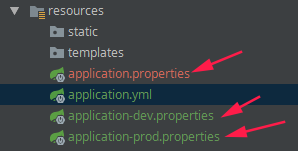

内容如下: 

`application.properties`:

```properties
# 默认环境的配置文件

server.port=80

# 默认用的就是 application.properties, 但是也可以通过下面的方法来指定别的(对于properties,对于yml是别的方式)

# 使用第二个（生产环境的）
spring.profiles.active=prod
```

`application-dev.properties`: 

```properties
# 开发环境的配置文件

server.port=8081
```

`application-prod.properties`:

```properties
# 生产环境的配置文件

server.port=8082
```

因为在`application.properties`中配置了使用`prod`环境，所以最终项目在`8082`端口启动了。

​	2、IDEA中配置命令行参数`--spring.profiles.active=dev`

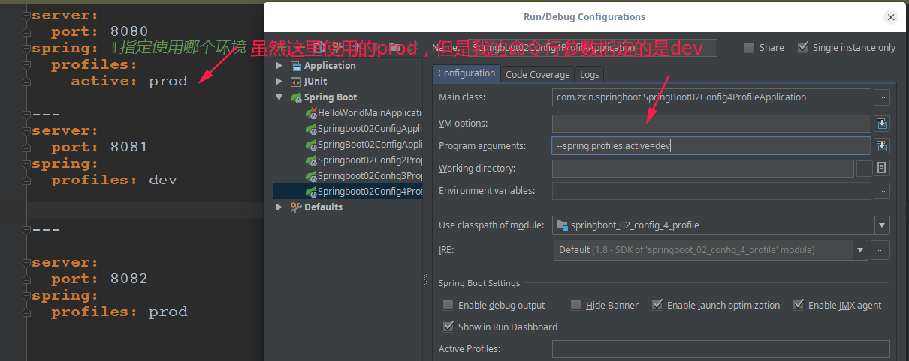

```c
o.s.b.w.embedded.tomcat.TomcatWebServer  : Tomcat started on port(s): 8081 
```

最终下面显示还是在`dev`这个环境中启动，所以说命令行参数的优先级`>`配置文件的优先级

​	３、命令行：`java -jar springboot_02_config_4_profile-0.0.1-SNAPSHOT.jar --spring.profiles.active=dev`

​	 可以直接在测试的时候，配置传入命令行参数

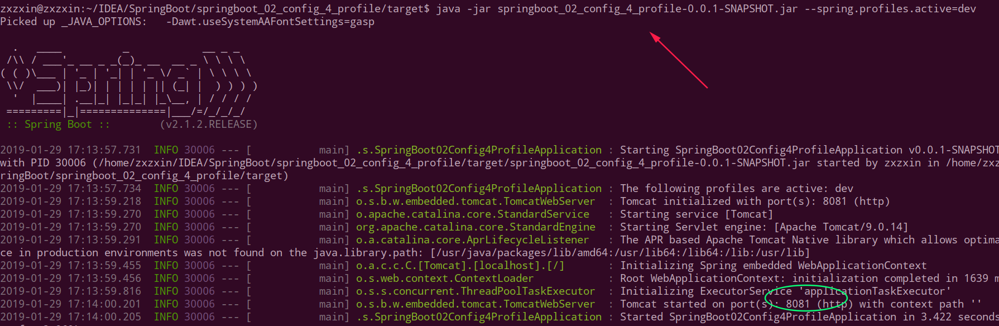

​	4、虚拟机参数: `-Dspring.profiles.active=dev`

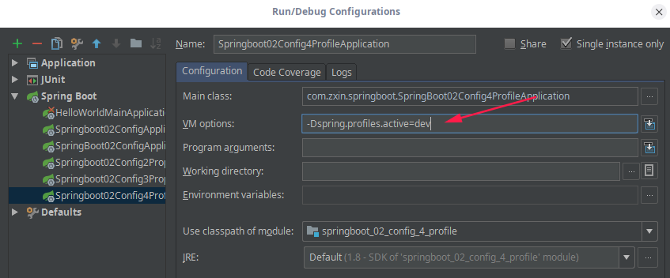

### 9、配置文件位置

> 项目: `springboot_02_config_5_locationofproperties`

SpringBoot 启动会扫描以下位置的`application.properties`或者`application.yml`文件作为Spring boot的默认配置文件

```c
–file:./config/
–file:./
–classpath:/config/
–classpath:/
```

**优先级由高到底，高优先级的配置会覆盖低优先级的配置；**

SpringBoot会从这四个位置全部加载主配置文件；**互补配置**；

例如：

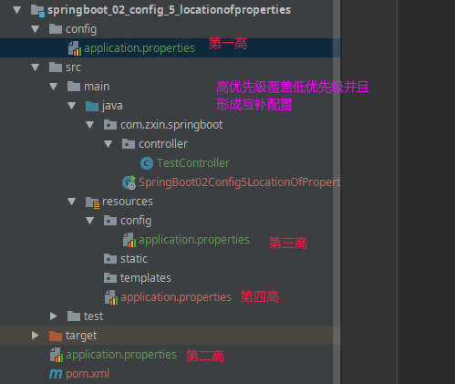

这里使用`–classpath:/config/`和`–classpath:/`下的两个`application.properties`来测试一下:

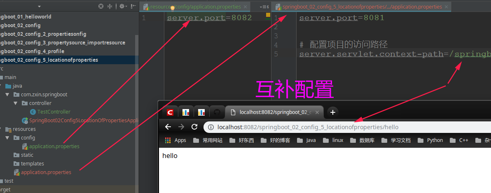


相关代码:

`classpath:/config/application.properties`：

```properties
server.port=8082
```

`classpath:/application.properties`:

```properties
server.port=8081

# 配置项目的访问路径
server.servlet.context-path=/springboot_02_config_5_locationofproperties
```

`TestController`:

```java
package com.zxin.springboot.controller;

import org.springframework.web.bind.annotation.RequestMapping;
import org.springframework.web.bind.annotation.RestController;

@RestController
public class TestController {

    @RequestMapping("/hello")
    public String hello(){
        return "hello";
    }
}

```


我们还可以通过`spring.config.location`来改变默认的配置文件位置；

**项目打包好以后，我们可以使用命令行参数的形式，启动项目的时候来指定配置文件的新位置；指定配置文件和默认加载的这些配置文件共同起作用形成互补配置；**

`java -jar springboot_02_config_5_locationofproperties-0.0.1-SNAPSHOT.jar --spring.config.location=/home/zxzxin/IDEA/application.properties`

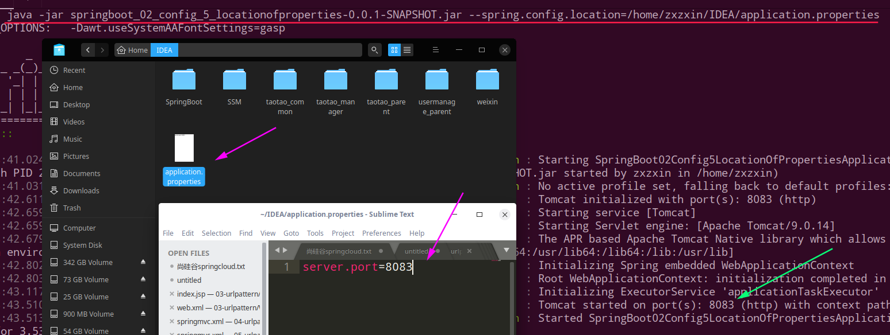


### 10、外部配置加载顺序

**SpringBoot也可以从以下位置加载配置； 优先级从高到低；高优先级的配置覆盖低优先级的配置，所有的配置会形成互补配置**，下面的11个配置重点是5个加粗样式的。

**1.命令行参数**

所有的配置都可以在命令行上进行指定

java -jar spring-boot-02-config-02-0.0.1-SNAPSHOT.jar --server.port=8087  --server.context-path=/abc

多个配置用空格分开； `--配置项=值`

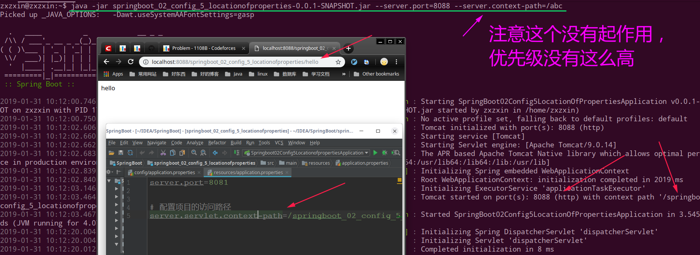

2.来自java:comp/env的JNDI属性

3.Java系统属性（System.getProperties()）

4.操作系统环境变量

5.RandomValuePropertySource配置的random.*属性值

**由jar包外向jar包内进行寻找；**

**优先加载带profile**

**6.jar包外部的`application-{profile}.properties`或`application.yml`(带`spring.profile`)配置文件**

**7.jar包内部的`application-{profile}.properties`或`application.yml`(带`spring.profile`)配置文件**

**再来加载不带profile**

**8.jar包外部的`application.properties`或`application.yml`(不带`spring.profile`)配置文件**

**9.jar包内部的`application.properties`或`application.yml`(不带`spring.profile`)配置文件**

10.@Configuration注解类上的@PropertySource

11.通过SpringApplication.setDefaultProperties指定的默认属性

所有支持的配置加载来源；

[详细参考官方文档](https://docs.spring.io/spring-boot/docs/1.5.9.RELEASE/reference/htmlsingle/#boot-features-external-config)


### 11、自动配置原理-重点


配置文件到底能写什么？怎么写？自动配置原理；

[配置文件能配置的属性参照](https://docs.spring.io/spring-boot/docs/1.5.9.RELEASE/reference/htmlsingle/#common-application-properties)

#### (1)、**自动配置原理：**

1）、SpringBoot启动的时候加载**主配置类**，开启了自动配置功能` @EnableAutoConfiguration`

**2）、@EnableAutoConfiguration 作用：**

 - 利用`EnableAutoConfigurationImportSelector`给容器中导入一些组件；

- 可以查看`selectImports()`方法的内容；

- `List<String> configurations = getCandidateConfigurations(annotationMetadata,      attributes);`**获取候选的配置**: 

  - ```java
    List<String> configurations = SpringFactoriesLoader.loadFactoryNames(this.getSpringFactoriesLoaderFactoryClass(), this.getBeanClassLoader());
    即SpringFactoriesLoader.loadFactoryNames()
    扫描所有jar包SpringFactoriesLoader.loadFactoryNames类路径下 META-INF/spring.factories
    把扫描到的这些文件的内容包装成properties对象
    从properties中获取到EnableAutoConfiguration.class类（类名）对应的值，然后把他们添加在容器中
    ```

  - **将 类路径下 ` META-INF/spring.factories `里面配置的所有`EnableAutoConfiguration`的值加入到了容器中**；以下是`spring.factories`的内容。


```properties
# Auto Configure
org.springframework.boot.autoconfigure.EnableAutoConfiguration=\
org.springframework.boot.autoconfigure.admin.SpringApplicationAdminJmxAutoConfiguration,\
org.springframework.boot.autoconfigure.aop.AopAutoConfiguration,\
org.springframework.boot.autoconfigure.amqp.RabbitAutoConfiguration,\
org.springframework.boot.autoconfigure.batch.BatchAutoConfiguration,\
org.springframework.boot.autoconfigure.cache.CacheAutoConfiguration,\
org.springframework.boot.autoconfigure.cassandra.CassandraAutoConfiguration,\
org.springframework.boot.autoconfigure.cloud.CloudAutoConfiguration,\
org.springframework.boot.autoconfigure.context.ConfigurationPropertiesAutoConfiguration,\
org.springframework.boot.autoconfigure.context.MessageSourceAutoConfiguration,\
org.springframework.boot.autoconfigure.context.PropertyPlaceholderAutoConfiguration,\
org.springframework.boot.autoconfigure.couchbase.CouchbaseAutoConfiguration,\
org.springframework.boot.autoconfigure.dao.PersistenceExceptionTranslationAutoConfiguration,\
org.springframework.boot.autoconfigure.data.cassandra.CassandraDataAutoConfiguration,\
org.springframework.boot.autoconfigure.data.cassandra.CassandraRepositoriesAutoConfiguration,\
org.springframework.boot.autoconfigure.data.couchbase.CouchbaseDataAutoConfiguration,\
org.springframework.boot.autoconfigure.data.couchbase.CouchbaseRepositoriesAutoConfiguration,\
org.springframework.boot.autoconfigure.data.elasticsearch.ElasticsearchAutoConfiguration,\
org.springframework.boot.autoconfigure.data.elasticsearch.ElasticsearchDataAutoConfiguration,\
org.springframework.boot.autoconfigure.data.elasticsearch.ElasticsearchRepositoriesAutoConfiguration,\
org.springframework.boot.autoconfigure.data.jpa.JpaRepositoriesAutoConfiguration,\
org.springframework.boot.autoconfigure.data.ldap.LdapDataAutoConfiguration,\
org.springframework.boot.autoconfigure.data.ldap.LdapRepositoriesAutoConfiguration,\
org.springframework.boot.autoconfigure.data.mongo.MongoDataAutoConfiguration,\
org.springframework.boot.autoconfigure.data.mongo.MongoRepositoriesAutoConfiguration,\
org.springframework.boot.autoconfigure.data.neo4j.Neo4jDataAutoConfiguration,\
org.springframework.boot.autoconfigure.data.neo4j.Neo4jRepositoriesAutoConfiguration,\
org.springframework.boot.autoconfigure.data.solr.SolrRepositoriesAutoConfiguration,\
org.springframework.boot.autoconfigure.data.redis.RedisAutoConfiguration,\
org.springframework.boot.autoconfigure.data.redis.RedisRepositoriesAutoConfiguration,\
org.springframework.boot.autoconfigure.data.rest.RepositoryRestMvcAutoConfiguration,\
org.springframework.boot.autoconfigure.data.web.SpringDataWebAutoConfiguration,\
org.springframework.boot.autoconfigure.elasticsearch.jest.JestAutoConfiguration,\
org.springframework.boot.autoconfigure.freemarker.FreeMarkerAutoConfiguration,\
org.springframework.boot.autoconfigure.gson.GsonAutoConfiguration,\
org.springframework.boot.autoconfigure.h2.H2ConsoleAutoConfiguration,\
org.springframework.boot.autoconfigure.hateoas.HypermediaAutoConfiguration,\
org.springframework.boot.autoconfigure.hazelcast.HazelcastAutoConfiguration,\
org.springframework.boot.autoconfigure.hazelcast.HazelcastJpaDependencyAutoConfiguration,\
org.springframework.boot.autoconfigure.info.ProjectInfoAutoConfiguration,\
org.springframework.boot.autoconfigure.integration.IntegrationAutoConfiguration,\
org.springframework.boot.autoconfigure.jackson.JacksonAutoConfiguration,\
org.springframework.boot.autoconfigure.jdbc.DataSourceAutoConfiguration,\
org.springframework.boot.autoconfigure.jdbc.JdbcTemplateAutoConfiguration,\
org.springframework.boot.autoconfigure.jdbc.JndiDataSourceAutoConfiguration,\
org.springframework.boot.autoconfigure.jdbc.XADataSourceAutoConfiguration,\
org.springframework.boot.autoconfigure.jdbc.DataSourceTransactionManagerAutoConfiguration,\
org.springframework.boot.autoconfigure.jms.JmsAutoConfiguration,\
org.springframework.boot.autoconfigure.jmx.JmxAutoConfiguration,\
org.springframework.boot.autoconfigure.jms.JndiConnectionFactoryAutoConfiguration,\
org.springframework.boot.autoconfigure.jms.activemq.ActiveMQAutoConfiguration,\
org.springframework.boot.autoconfigure.jms.artemis.ArtemisAutoConfiguration,\
org.springframework.boot.autoconfigure.flyway.FlywayAutoConfiguration,\
org.springframework.boot.autoconfigure.groovy.template.GroovyTemplateAutoConfiguration,\
org.springframework.boot.autoconfigure.jersey.JerseyAutoConfiguration,\
org.springframework.boot.autoconfigure.jooq.JooqAutoConfiguration,\
org.springframework.boot.autoconfigure.kafka.KafkaAutoConfiguration,\
org.springframework.boot.autoconfigure.ldap.embedded.EmbeddedLdapAutoConfiguration,\
org.springframework.boot.autoconfigure.ldap.LdapAutoConfiguration,\
org.springframework.boot.autoconfigure.liquibase.LiquibaseAutoConfiguration,\
org.springframework.boot.autoconfigure.mail.MailSenderAutoConfiguration,\
org.springframework.boot.autoconfigure.mail.MailSenderValidatorAutoConfiguration,\
org.springframework.boot.autoconfigure.mobile.DeviceResolverAutoConfiguration,\
org.springframework.boot.autoconfigure.mobile.DeviceDelegatingViewResolverAutoConfiguration,\
org.springframework.boot.autoconfigure.mobile.SitePreferenceAutoConfiguration,\
org.springframework.boot.autoconfigure.mongo.embedded.EmbeddedMongoAutoConfiguration,\
org.springframework.boot.autoconfigure.mongo.MongoAutoConfiguration,\
org.springframework.boot.autoconfigure.mustache.MustacheAutoConfiguration,\
org.springframework.boot.autoconfigure.orm.jpa.HibernateJpaAutoConfiguration,\
org.springframework.boot.autoconfigure.reactor.ReactorAutoConfiguration,\
org.springframework.boot.autoconfigure.security.SecurityAutoConfiguration,\
org.springframework.boot.autoconfigure.security.SecurityFilterAutoConfiguration,\
org.springframework.boot.autoconfigure.security.FallbackWebSecurityAutoConfiguration,\
org.springframework.boot.autoconfigure.security.oauth2.OAuth2AutoConfiguration,\
org.springframework.boot.autoconfigure.sendgrid.SendGridAutoConfiguration,\
org.springframework.boot.autoconfigure.session.SessionAutoConfiguration,\
org.springframework.boot.autoconfigure.social.SocialWebAutoConfiguration,\
org.springframework.boot.autoconfigure.social.FacebookAutoConfiguration,\
org.springframework.boot.autoconfigure.social.LinkedInAutoConfiguration,\
org.springframework.boot.autoconfigure.social.TwitterAutoConfiguration,\
org.springframework.boot.autoconfigure.solr.SolrAutoConfiguration,\
org.springframework.boot.autoconfigure.thymeleaf.ThymeleafAutoConfiguration,\
org.springframework.boot.autoconfigure.transaction.TransactionAutoConfiguration,\
org.springframework.boot.autoconfigure.transaction.jta.JtaAutoConfiguration,\
org.springframework.boot.autoconfigure.validation.ValidationAutoConfiguration,\
org.springframework.boot.autoconfigure.web.DispatcherServletAutoConfiguration,\
org.springframework.boot.autoconfigure.web.EmbeddedServletContainerAutoConfiguration,\
org.springframework.boot.autoconfigure.web.ErrorMvcAutoConfiguration,\
org.springframework.boot.autoconfigure.web.HttpEncodingAutoConfiguration,\
org.springframework.boot.autoconfigure.web.HttpMessageConvertersAutoConfiguration,\
org.springframework.boot.autoconfigure.web.MultipartAutoConfiguration,\
org.springframework.boot.autoconfigure.web.ServerPropertiesAutoConfiguration,\
org.springframework.boot.autoconfigure.web.WebClientAutoConfiguration,\
org.springframework.boot.autoconfigure.web.WebMvcAutoConfiguration,\
org.springframework.boot.autoconfigure.websocket.WebSocketAutoConfiguration,\
org.springframework.boot.autoconfigure.websocket.WebSocketMessagingAutoConfiguration,\
org.springframework.boot.autoconfigure.webservices.WebServicesAutoConfiguration
```

每一个这样的`xxxAutoConfiguration`类都是容器中的一个组件，都加入到容器中；用他们来做自动配置；

3）、每一个自动配置类进行自动配置功能；

4）、以**HttpEncodingAutoConfiguration（Http编码自动配置）**为例解释自动配置原理；

```java
@Configuration   //表示这是一个配置类，以前编写的配置文件一样，也可以给容器中添加组件
@EnableConfigurationProperties(HttpEncodingProperties.class)  //启动指定类的ConfigurationProperties功能；将配置文件中对应的值和HttpEncodingProperties绑定起来；并把HttpEncodingProperties加入到ioc容器中

@ConditionalOnWebApplication //Spring底层@Conditional注解（Spring注解版），根据不同的条件，如果满足指定的条件，整个配置类里面的配置就会生效；    判断当前应用是否是web应用，如果是，当前配置类生效

@ConditionalOnClass(CharacterEncodingFilter.class)  //判断当前项目有没有这个类CharacterEncodingFilter；SpringMVC中进行乱码解决的过滤器；

@ConditionalOnProperty(prefix = "spring.http.encoding", value = "enabled", matchIfMissing = true)  //判断配置文件中是否存在某个配置  spring.http.encoding.enabled；如果不存在，判断也是成立的
//即使我们配置文件中不配置pring.http.encoding.enabled=true，也是默认生效的；
public class HttpEncodingAutoConfiguration {
  
  	//它已经和SpringBoot的配置文件映射了
  	private final HttpEncodingProperties properties;
  
   //只有一个有参构造器的情况下，参数的值就会从容器中拿 (放到ioc)
  	public HttpEncodingAutoConfiguration(HttpEncodingProperties properties) {
		this.properties = properties;
	}
  
    @Bean   //给容器中添加一个组件，这个组件的某些值需要从properties中获取
	@ConditionalOnMissingBean(CharacterEncodingFilter.class) //判断容器没有这个组件？
	public CharacterEncodingFilter characterEncodingFilter() {
		CharacterEncodingFilter filter = new OrderedCharacterEncodingFilter();
		filter.setEncoding(this.properties.getCharset().name());
		filter.setForceRequestEncoding(this.properties.shouldForce(Type.REQUEST));
		filter.setForceResponseEncoding(this.properties.shouldForce(Type.RESPONSE));
		return filter;
	}
```

**根据当前不同的条件判断，决定这个配置类是否生效。**

**一旦这个配置类生效；这个配置类就会给容器中添加各种组件；这些组件的属性是从对应的`properties`类中获取的，这些类里面的每一个属性又是和配置文件绑定的；**


5）、**所有在配置文件中能配置的属性都是在xxxxProperties类中封装者；配置文件能配置什么就可以参照某个功能对应的这个属性类**

```java
@ConfigurationProperties(prefix = "spring.http.encoding")  //从配置文件中获取指定的值和bean的属性进行绑定
public class HttpEncodingProperties {
   public static final Charset DEFAULT_CHARSET = Charset.forName("UTF-8");
}
```


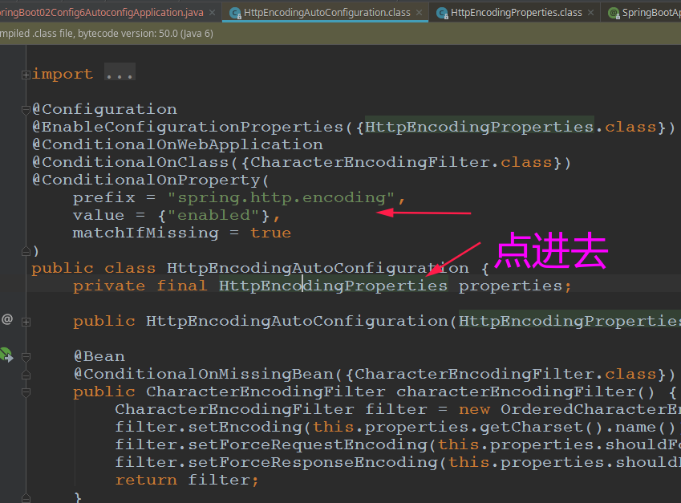


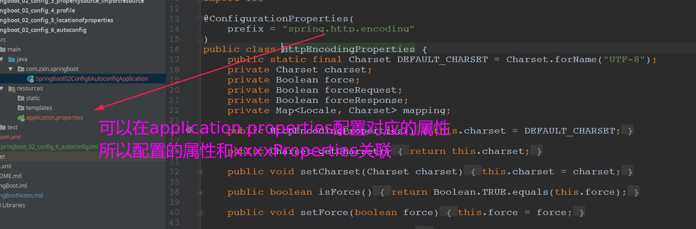

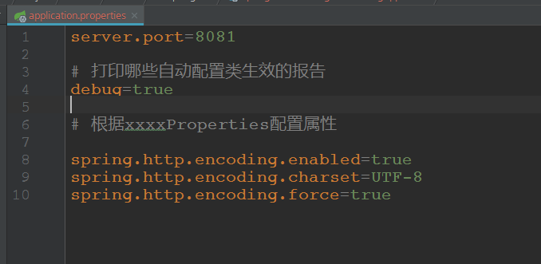

**SpringBoot精髓：**

​	1）、SpringBoot启动会加载大量的自动配置类

​	2）、我们看我们需要的功能有没有SpringBoot默认写好的自动配置类；

​	3）、我们再来看这个自动配置类中到底配置了哪些组件；（只要我们要用的组件有，我们就不需要再来配置了）

​	4）、**给容器中自动配置类添加组件的时候，会从xxxProperties类中获取某些属性。我们就可以在配置文件中指定这些属性的值；**


① `xxxxAutoConfigurartion`：自动配置类 ---> 给容器中添加组件；

② `xxxxProperties` : 封装配置文件中相关属性；


#### (2)、细节-@Conditional派生注解（Spring注解版原生的@Conditional作用）

作用：必须是`@Conditional`指定的条件成立，才给容器中添加组件，配置配里面的所有内容才生效；

| @Conditional扩展注解            | 作用（判断是否满足当前指定条件）                 |
| ------------------------------- | ------------------------------------------------ |
| @ConditionalOnJava              | 系统的java版本是否符合要求                       |
| @ConditionalOnBean              | 容器中存在指定Bean；                             |
| @ConditionalOnMissingBean       | 容器中不存在指定Bean；                           |
| @ConditionalOnExpression        | 满足SpEL表达式指定                               |
| @ConditionalOnClass             | 系统中有指定的类                                 |
| @ConditionalOnMissingClass      | 系统中没有指定的类                               |
| @ConditionalOnSingleCandidate   | 容器中只有一个指定的Bean，或者这个Bean是首选Bean |
| @ConditionalOnProperty          | 系统中指定的属性是否有指定的值                   |
| @ConditionalOnResource          | 类路径下是否存在指定资源文件                     |
| @ConditionalOnWebApplication    | 当前是web环境                                    |
| @ConditionalOnNotWebApplication | 当前不是web环境                                  |
| @ConditionalOnJndi              | JNDI存在指定项                                   |

**自动配置类必须在一定的条件下才能生效；**

我们怎么知道哪些自动配置类生效；

**我们可以通过启用  debug=true属性；来让控制台打印自动配置报告**，这样我们就可以很方便的知道哪些自动配置类生效；

```java
=========================
AUTO-CONFIGURATION REPORT
=========================


Positive matches:（自动配置类启用的）
-----------------

   DispatcherServletAutoConfiguration matched:
      - @ConditionalOnClass found required class 'org.springframework.web.servlet.DispatcherServlet'; @ConditionalOnMissingClass did not find unwanted class (OnClassCondition)
      - @ConditionalOnWebApplication (required) found StandardServletEnvironment (OnWebApplicationCondition)

...等等
        
    
Negative matches:（没有启动，没有匹配成功的自动配置类）
-----------------

   ActiveMQAutoConfiguration:
      Did not match:
         - @ConditionalOnClass did not find required classes 'javax.jms.ConnectionFactory', 'org.apache.activemq.ActiveMQConnectionFactory' (OnClassCondition)

   AopAutoConfiguration:
      Did not match:
         - @ConditionalOnClass did not find required classes 'org.aspectj.lang.annotation.Aspect', 'org.aspectj.lang.reflect.Advice' (OnClassCondition)

...等等
        
```

***

## 三、日志

### 1、日志框架

一个小故事: 

>  小张；开发一个大型系统；
>
> ​	1、System.out.println("")；将关键数据打印在控制台；去掉？写在一个文件？
>
> ​	2、框架来记录系统的一些运行时信息；日志框架 ；  zhanglogging.jar；
>
> ​	3、高大上的几个功能？异步模式？自动归档？xxxx？  zhanglogging-good.jar？
>
> ​	4、将以前框架卸下来？换上新的框架，重新修改之前相关的API；zhanglogging-prefect.jar；
>
> ​	5、JDBC---数据库驱动；
>
> ​		写了一个统一的接口层；日志门面（日志的一个抽象层）；logging-abstract.jar；
>
> ​		给项目中导入具体的日志实现就行了；我们之前的日志框架都是实现的抽象层；


**市面上的日志框架 : **

`JUL、JCL、Jboss-logging、logback、log4j、log4j2、slf4j....`

| 日志门面  （日志的抽象层）                                   | 日志实现                                             |
| ------------------------------------------------------------ | ---------------------------------------------------- |
| ~~JCL（Jakarta  Commons Logging）~~    **SLF4j（Simple  Logging Facade for Java）**    ~~jboss-logging~~ | Log4j  JUL（java.util.logging）  Log4j2  **Logback** |

**左边选一个门面（抽象层）、右边来选一个实现；**

我们最终选用的是: 

* 日志门面：  SLF4J；
* 日志实现：Logback；

SpringBoot：底层是Spring框架，Spring框架默认是用JCL；**SpringBoot选用 SLF4j和logback；**

### 2、SLF4j使用

**如何在系统中使用SLF4j   https://www.slf4j.org**

以后开发的时候，日志记录方法的调用，不应该来直接调用日志的实现类，而是调用日志抽象层里面的方法；

给系统里面导入`slf4j`的`jar`和 ` logback`的实现`jar`

```java
import org.slf4j.Logger;
import org.slf4j.LoggerFactory;

public class HelloWorld {
  public static void main(String[] args) {
    Logger logger = LoggerFactory.getLogger(HelloWorld.class);
    logger.info("Hello World");
  }
}
```

图示；

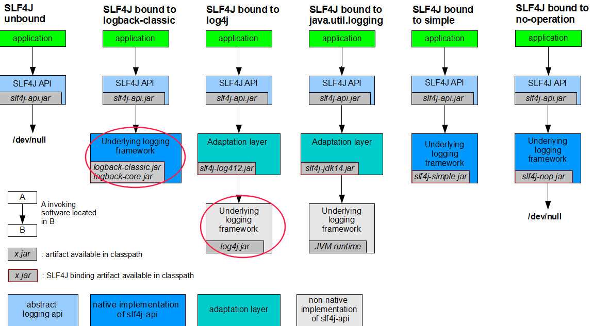

每一个日志的实现框架都有自己的配置文件。使用`slf4j`以后，**配置文件还是做成日志实现框架自己本身的配置文件；**

### 3、SpringBoot和其他框架整合时日志的统一管理问题-legacyProblem

SpringBoot（slf4j+logback）、Spring（commons-logging）、Hibernate（jboss-logging）、MyBatis、xxxx

统一日志记录，即使是别的框架和我一起统一使用slf4j进行输出？


**如何让系统中所有的日志都统一到`slf4j`；**

1、将系统中其他日志框架先排除出去；

2、用中间包来替换原有的日志框架；

3、我们导入`slf4j`其他的实现

### 4、SpringBoot日志关系

首先依赖于`spring-boot-starter`

```xml
<dependency>
    <groupId>org.springframework.boot</groupId>
    <artifactId>spring-boot-starter</artifactId>
</dependency>
```

其中`spring-boot-starter`又包含`spring-boot-starter-logging`，使用它来做日志功能；

```xml
<dependency>
    <groupId>org.springframework.boot</groupId>
    <artifactId>spring-boot-starter-logging</artifactId>
</dependency>
```

底层依赖关系: 

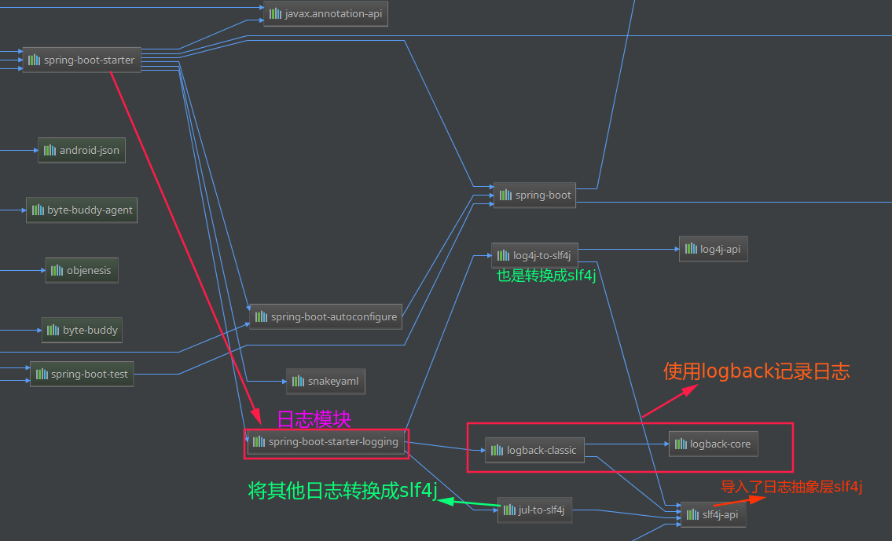

总结：

​	1）、SpringBoot底层也是使用`slf4j+logback`的方式进行日志记录；

​	2）、SpringBoot也把其他的日志都替换成了`slf4j`；

​	3）、中间替换包：`jcl-over-slf4j.jar、log4j-over-slf4j.jar、jul-to-slf4j.jawr`等；

```java
public abstract class LogFactory {
    static String UNSUPPORTED_OPERATION_IN_JCL_OVER_SLF4J = "http://www.slf4j.org/codes.html#unsupported_operation_in_jcl_over_slf4j";
    static LogFactory logFactory = new SLF4JLogFactory();
    public static final String PRIORITY_KEY = "priority";
    public static final String TCCL_KEY = "use_tccl";
    public static final String FACTORY_PROPERTY = "org.apache.commons.logging.LogFactory";
    public static final String FACTORY_DEFAULT = "org.apache.commons.logging.impl.SLF4JLogFactory";
    public static final String FACTORY_PROPERTIES = "commons-logging.properties";
    protected static final String SERVICE_ID = "META-INF/services/org.apache.commons.logging.LogFactory";
    public static final String DIAGNOSTICS_DEST_PROPERTY = "org.apache.commons.logging.diagnostics.dest";
    public static final String HASHTABLE_IMPLEMENTATION_PROPERTY = "org.apache.commons.logging.LogFactory.HashtableImpl";
    protected static Hashtable factories = null;
    protected static LogFactory nullClassLoaderFactory = null;

    protected LogFactory() {
    }
}
```


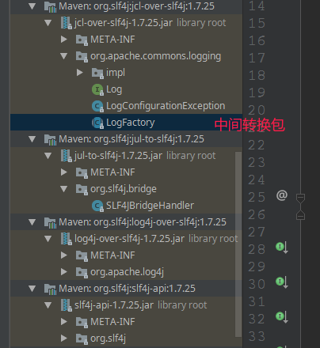

​	4）、如果我们要引入其他框架，一定要把这个框架的默认日志依赖移除掉；

​		Spring框架用的是`commons-logging`；(这里如果是前面`1.5`版本的会有下面的代码，但是`2.0+`版本的没有)

```xml
<dependency>
    <groupId>org.springframework</groupId>
    <artifactId>spring-core</artifactId>
    <exclusions>
        <exclusion>
            <groupId>commons-logging</groupId>
            <artifactId>commons-logging</artifactId>
        </exclusion>
    </exclusions>
</dependency>
```

**SpringBoot能自动适配所有的日志，而且底层使用`slf4j+logback`的方式记录日志，引入其他框架的时候，只需要把这个框架依赖的日志框架排除掉即可；**

### 5、日志使用

> `springboot_03_logging`项目。

SpringBoot默认帮我们配置好了日志；

```java
@RunWith(SpringRunner.class)
@SpringBootTest
public class SpringBoot03LoggingApplicationTests {

	Logger logger = LoggerFactory.getLogger(getClass());

	//记录器
	@Test
	public void contextLoads() {
		// 日志的级别, 这些日志的级别 由低到高 trace < debug < info < warn < error
		// 可以调整输出的日志级别, 日志就只会在这个级别 级 以后的高级别生效
		logger.trace("这是trace日志...");
		logger.debug("这是debug日志...");
		// SpringBoot默认给我们使用的是info级别, 没有指定级别的就用SpringBoot指定的默认级别(root级别)
		logger.info("这是info日志...");
		logger.warn("这是warn日志...");
		logger.error("这是error日志");
	}
}

```

SpringBoot修改日志的默认配置

```properties
# 将com.zxin包的日志级别调成 trace 级别
logging.level.com.zxin=trace

#logging.path=
# 不指定路径在当前项目下生成springboot.log日志
# 可以指定完整的路径；
#logging.file=G:/springboot.log

# 在当前磁盘的根路径下创建spring文件夹和里面的log文件夹；使用 spring.log 作为默认文件
logging.path=/spring/log

#  在控制台输出的日志的格式
logging.pattern.console=%d{yyyy-MM-dd} [%thread] %-5level %logger{50} - %msg%n
# 指定文件中日志输出的格式
logging.pattern.file=%d{yyyy-MM-dd} === [%thread] === %-5level === %logger{50} ==== %msg%n
```

| logging.file | logging.path | Example  | Description                        |
| ------------ | ------------ | -------- | ---------------------------------- |
| (none)       | (none)       |          | 只在控制台输出                     |
| 指定文件名   | (none)       | my.log   | 输出日志到my.log文件               |
| (none)       | 指定目录     | /var/log | 输出到指定目录的 spring.log 文件中 |

默认配置文件位置: 

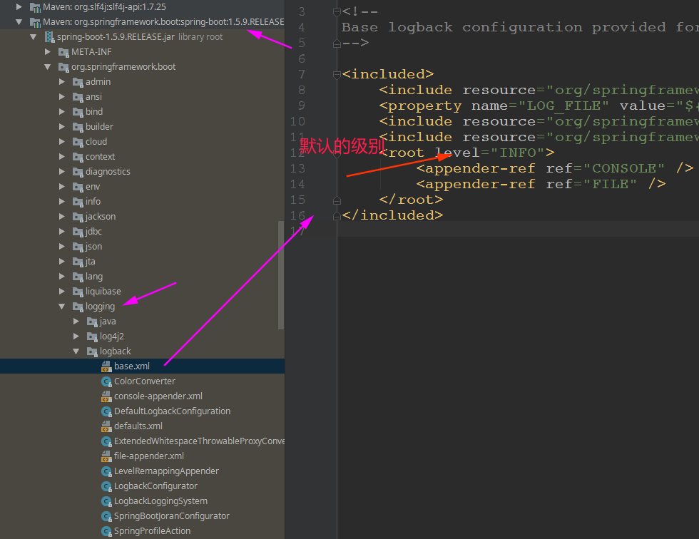

**指定配置**

给类路径下放上每个日志框架自己的配置文件即可；SpringBoot就不使用他默认配置的了

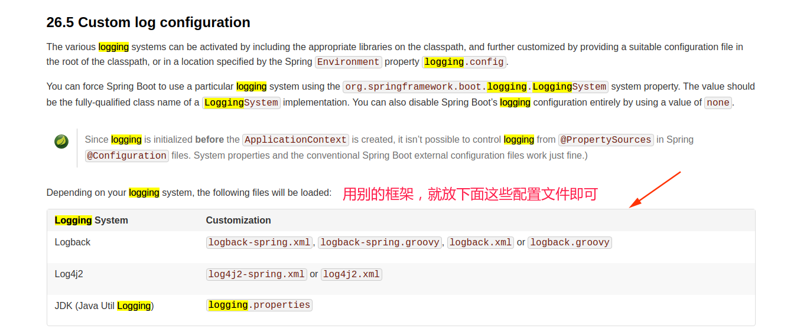

| Logging System          | Customization                                                |
| ----------------------- | ------------------------------------------------------------ |
| Logback                 | `logback-spring.xml`, `logback-spring.groovy`, `logback.xml` or `logback.groovy` |
| Log4j2                  | `log4j2-spring.xml` or `log4j2.xml`                          |
| JDK (Java Util Logging) | `logging.properties`                                         |

`logback.xml`：直接就被日志框架识别了；

**`logback-spring.xml`**：日志框架就不直接加载日志的配置项，由SpringBoot解析日志配置，可以使用SpringBoot的高级Profile功能

```xml
<springProfile name="staging">
    <!-- configuration to be enabled when the "staging" profile is active -->
  	可以指定某段配置只在某个环境下生效
</springProfile>

```

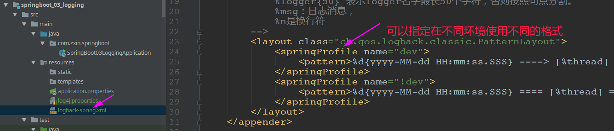

`logback-spring.xml`配置文件如下：

```xml
<?xml version="1.0" encoding="UTF-8"?>
<!--
scan：当此属性设置为true时，配置文件如果发生改变，将会被重新加载，默认值为true。
scanPeriod：设置监测配置文件是否有修改的时间间隔，如果没有给出时间单位，默认单位是毫秒当scan为true时，此属性生效。默认的时间间隔为1分钟。
debug：当此属性设置为true时，将打印出logback内部日志信息，实时查看logback运行状态。默认值为false。
-->
<configuration scan="false" scanPeriod="60 seconds" debug="false">
    <!-- 定义日志的根目录 -->
    <property name="LOG_HOME" value="log/zxlog" />
    <!-- 定义日志文件名称 -->
    <property name="appName" value="zxin-springboot"></property>
    <!-- ch.qos.logback.core.ConsoleAppender 表示控制台输出 -->
    <appender name="stdout" class="ch.qos.logback.core.ConsoleAppender">
        <!--
        日志输出格式：
			%d表示日期时间，
			%thread表示线程名，
			%-5level：级别从左显示5个字符宽度
			%logger{50} 表示logger名字最长50个字符，否则按照句点分割。 
			%msg：日志消息，
			%n是换行符
        -->
        <layout class="ch.qos.logback.classic.PatternLayout">
            <springProfile name="dev">
                <pattern>%d{yyyy-MM-dd HH:mm:ss.SSS} ----> [%thread] ---> %-5level %logger{50} - %msg%n</pattern>
            </springProfile>
            <springProfile name="!dev">
                <pattern>%d{yyyy-MM-dd HH:mm:ss.SSS} ==== [%thread] ==== %-5level %logger{50} - %msg%n</pattern>
            </springProfile>
        </layout>
    </appender>

    <!-- 滚动记录文件，先将日志记录到指定文件，当符合某个条件时，将日志记录到其他文件 -->  
    <appender name="appLogAppender" class="ch.qos.logback.core.rolling.RollingFileAppender">
        <!-- 指定日志文件的名称 -->
        <file>${LOG_HOME}/${appName}.log</file>
        <!--
        当发生滚动时，决定 RollingFileAppender 的行为，涉及文件移动和重命名
        TimeBasedRollingPolicy： 最常用的滚动策略，它根据时间来制定滚动策略，既负责滚动也负责出发滚动。
        -->
        <rollingPolicy class="ch.qos.logback.core.rolling.TimeBasedRollingPolicy">
            <!--
            滚动时产生的文件的存放位置及文件名称 %d{yyyy-MM-dd}：按天进行日志滚动 
            %i：当文件大小超过maxFileSize时，按照i进行文件滚动
            -->
            <fileNamePattern>${LOG_HOME}/${appName}-%d{yyyy-MM-dd}-%i.log</fileNamePattern>
            <!-- 
            可选节点，控制保留的归档文件的最大数量，超出数量就删除旧文件。假设设置每天滚动，
            且maxHistory是365，则只保存最近365天的文件，删除之前的旧文件。注意，删除旧文件是，
            那些为了归档而创建的目录也会被删除。
            -->
            <MaxHistory>365</MaxHistory>
            <!-- 
            当日志文件超过maxFileSize指定的大小是，根据上面提到的%i进行日志文件滚动 注意此处配置SizeBasedTriggeringPolicy是无法实现按文件大小进行滚动的，必须配置timeBasedFileNamingAndTriggeringPolicy
            -->
            <timeBasedFileNamingAndTriggeringPolicy class="ch.qos.logback.core.rolling.SizeAndTimeBasedFNATP">
                <maxFileSize>100MB</maxFileSize>
            </timeBasedFileNamingAndTriggeringPolicy>
        </rollingPolicy>
        <!-- 日志输出格式： -->     
        <layout class="ch.qos.logback.classic.PatternLayout">
            <pattern>%d{yyyy-MM-dd HH:mm:ss.SSS} [ %thread ] - [ %-5level ] [ %logger{50} : %line ] - %msg%n</pattern>
        </layout>
    </appender>

    <!-- 
		logger主要用于存放日志对象，也可以定义日志类型、级别
		name：表示匹配的logger类型前缀，也就是包的前半部分
		level：要记录的日志级别，包括 TRACE < DEBUG < INFO < WARN < ERROR
		additivity：作用在于children-logger是否使用 rootLogger配置的appender进行输出，
		false：表示只用当前logger的appender-ref，true：
		表示当前logger的appender-ref和rootLogger的appender-ref都有效
    -->
    <!-- hibernate logger -->
    <logger name="com.zxin" level="debug" />
    <!-- Spring framework logger -->
    <logger name="org.springframework" level="debug" additivity="false"></logger>

    <!-- 
    root与logger是父子关系，没有特别定义则默认为root，任何一个类只会和一个logger对应，
    要么是定义的logger，要么是root，判断的关键在于找到这个logger，然后判断这个logger的appender和level。 
    -->
    <root level="info">
        <appender-ref ref="stdout" />
        <appender-ref ref="appLogAppender" />
    </root>
</configuration> 
```

运行项目: 

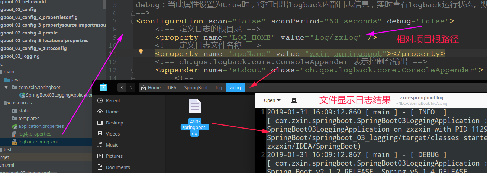

如果使用`logback.xml`作为日志配置文件，还要使用`profile`功能，会有以下错误: 

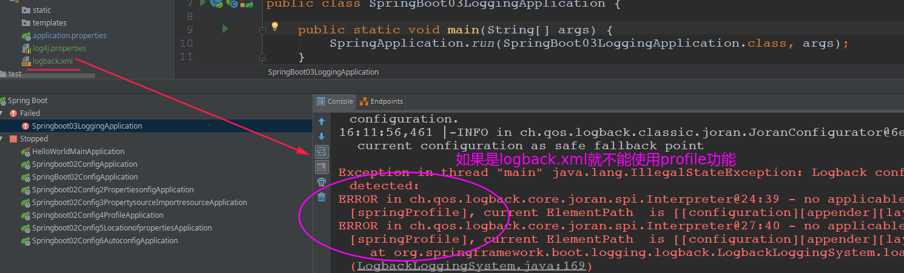

#### 6、日志框架切换

可以按照slf4j的日志适配图，进行相关的切换；

`slf4j+log4j`的方式；

在`sjf4j`中使用`log4j`(而不是`logback`): 

```xml
<dependency>
  <groupId>org.springframework.boot</groupId>
  <artifactId>spring-boot-starter-web</artifactId>
  <exclusions>
    <exclusion>
      <artifactId>logback-classic</artifactId>
      <groupId>ch.qos.logback</groupId>
    </exclusion>
    <exclusion>
      <artifactId>log4j-over-slf4j</artifactId>
      <groupId>org.slf4j</groupId>
    </exclusion>
  </exclusions>
</dependency>

<dependency>
  <groupId>org.slf4j</groupId>
  <artifactId>slf4j-log4j12</artifactId>
</dependency>
```

切换为`log4j2`(可能用到)

> `springboot_03_logging_2_uselog4j2`项目。

`pom.xml`改动:

```xml
<dependencies>
    <dependency>
        <groupId>org.springframework.boot</groupId>
        <artifactId>spring-boot-starter-web</artifactId>
        <exclusions> <!--排除默认的logging-->
            <exclusion>
                <artifactId>spring-boot-starter-logging</artifactId>
                <groupId>org.springframework.boot</groupId>
            </exclusion>
        </exclusions>
    </dependency>

    <!--导入log4j2-->
    <dependency>
        <groupId>org.springframework.boot</groupId>
        <artifactId>spring-boot-starter-log4j2</artifactId>
    </dependency>

    <!--测试-->
    <dependency>
        <groupId>org.springframework.boot</groupId>
        <artifactId>spring-boot-starter-test</artifactId>
        <scope>test</scope>
    </dependency>
</dependencies>
```
效果:

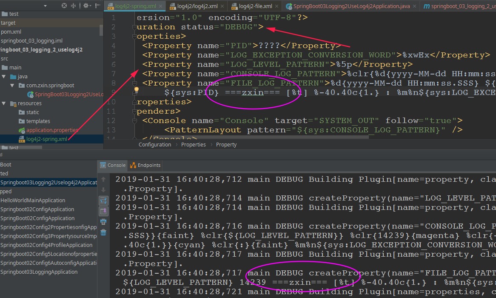

***

## 四、Web开发

### 1、简介

使用SpringBoot:

**1）、创建SpringBoot应用，选中我们需要的模块；**

**2）、SpringBoot已经默认将这些场景配置好了，只需要在配置文件中指定少量配置就可以运行起来；**

**3）、自己编写业务代码即可；**


**自动配置原理？**

这个场景SpringBoot帮我们配置了什么？能不能修改？能修改哪些配置？能不能扩展？xxx

* `xxxxAutoConfiguration`：帮我们给容器中自动配置组件；
* `xxxxProperties` : 配置类来封装配置文件的内容；


### 2、SpringBoot对静态资源的映射规则

和`SpringMVC`的自动配置都在`WebMVCAutoConfiguration`类中。下面是对**静态资源**的一些配置: 

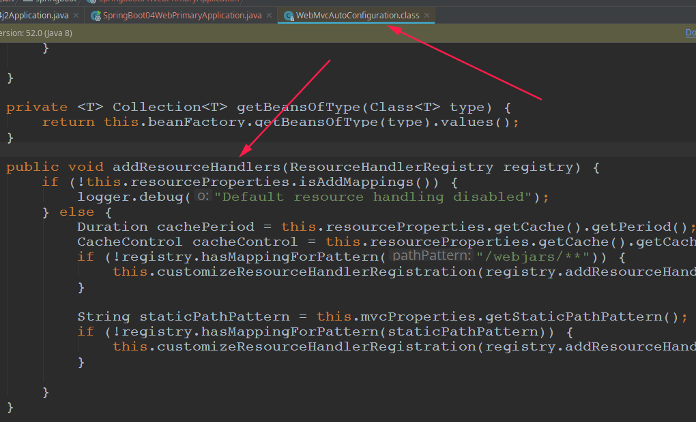

具体代码如下: 

```java
        public void addResourceHandlers(ResourceHandlerRegistry registry) {
            if (!this.resourceProperties.isAddMappings()) {
                logger.debug("Default resource handling disabled");
            } else {
                Duration cachePeriod = this.resourceProperties.getCache().getPeriod();
                CacheControl cacheControl = this.resourceProperties.getCache().getCachecontrol().toHttpCacheControl();
                if (!registry.hasMappingForPattern("/webjars/**")) {
                    this.customizeResourceHandlerRegistration(
                            registry.addResourceHandler(
                                new String[]{"/webjars/**"}).addResourceLocations(
                                    new String[]{"classpath:/META-INF/resources/webjars/"}).setCachePeriod(
                                        this.getSeconds(cachePeriod)).setCacheControl(cacheControl));
                }
                String staticPathPattern = this.mvcProperties.getStaticPathPattern();
                if (!registry.hasMappingForPattern(staticPathPattern)) {
                    this.customizeResourceHandlerRegistration(
                            registry.addResourceHandler(
                                new String[]{staticPathPattern}).addResourceLocations(
                                    getResourceLocations(
                                        this.resourceProperties.getStaticLocations())).setCachePeriod(
                                    this.getSeconds(cachePeriod)).setCacheControl(cacheControl));
                }
            }
        }
```

对这对代码的总结: 

1）、所有` /webjars/**` ，都去` classpath:/META-INF/resources/webjars/ `找资源；

`webjars`：以`jar`包的方式引入静态资源；http://www.webjars.org/

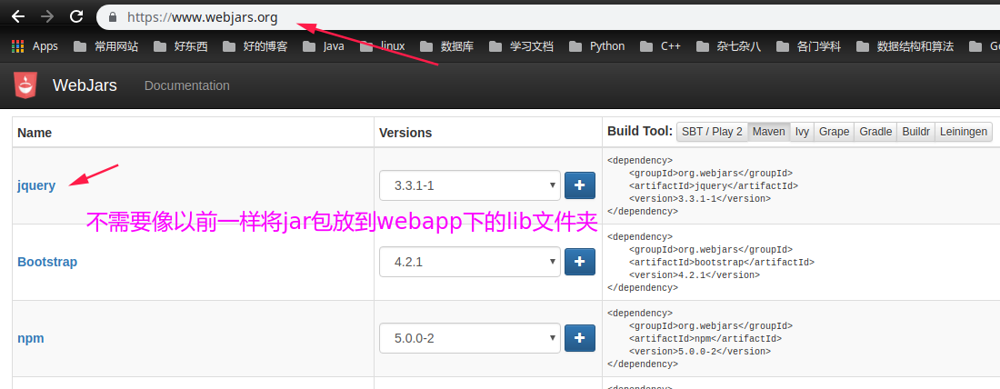

导入之后，查看`maven`依赖的目录结果，就是上面的` classpath:/META-INF/resources/webjars/ `目录: 

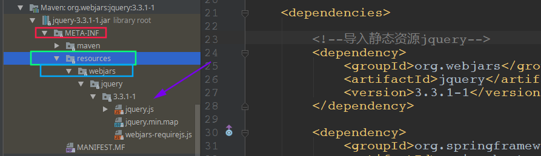

```xml
<!--导入静态资源jquery-->
<dependency>
    <groupId>org.webjars</groupId>
    <artifactId>jquery</artifactId>
    <version>3.3.1-1</version>
</dependency>
```

启动项目之后，可以直接在浏览器访问到`jquery`: 输入`http://localhost:8080/webjars/jquery/3.3.1-1/jquery.js`

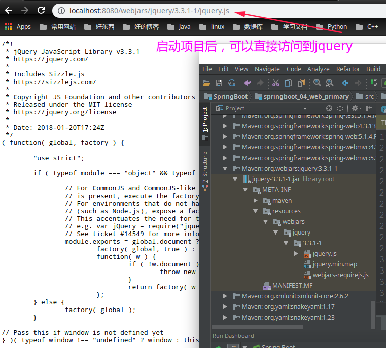


2）、`"/**"` 访问当前项目的任何资源(自己添加的静态资源)，都去（静态资源的文件夹）找映射

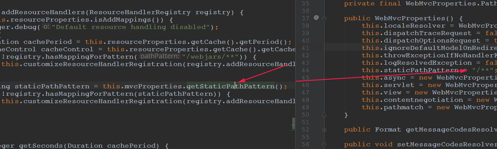

比如在上面的代码中还有一个行`Duration cachePeriod = this.resourceProperties.getCache().getPeriod();`

这个`resourceProperties`是类`ResourceProperties`的对象，可以设置和静态资源有关的参数，比如**缓存时间**等。相关代码如下: 

```java
@ConfigurationProperties(
    prefix = "spring.resources",
    ignoreUnknownFields = false
)
public class ResourceProperties {

    private static final String[] CLASSPATH_RESOURCE_LOCATIONS 
        = new String[]{"classpath:/META-INF/resources/", 
            "classpath:/resources/", 
            "classpath:/static/", 
            "classpath:/public/"};

    private String[] staticLocations;
    private boolean addMappings;
    private final ResourceProperties.Chain chain;
    private final ResourceProperties.Cache cache;

    public ResourceProperties() {
        this.staticLocations = CLASSPATH_RESOURCE_LOCATIONS;
        this.addMappings = true;
        this.chain = new ResourceProperties.Chain();
        this.cache = new ResourceProperties.Cache();
    }
}
```

下面就是几个**静态资源的文件夹**

```properties
"classpath:/META-INF/resources/", 
"classpath:/resources/",
"classpath:/static/", 
"classpath:/public/" 
"/"：当前项目的根路径
```

例如，访问项目的下静态资源`http://localhost:8080/asserts/js/Chart.min.js`去静态资源文件夹里面找`Chart.min.js`:


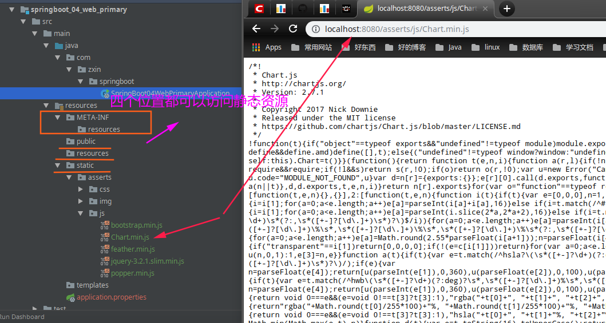


> 也可以在`application.properties`中定义自己的静态资源文件夹: 
>
> ```properties
> spring.resources.static-locations=classpath:/zxzxin/,classpath:/test/
> ```

3）、欢迎页； 静态资源文件夹下的所有`index.html`页面，被`"/**"`映射；

`localhost:8080/`   找`index.html`页面

```java
    @Bean
    public WelcomePageHandlerMapping welcomePageHandlerMapping(
            ApplicationContext applicationContext) {

        return new WelcomePageHandlerMapping(
                new TemplateAvailabilityProviders(
                    applicationContext), applicationContext,
                this.getWelcomePage(), this.mvcProperties.getStaticPathPattern());
    }
```

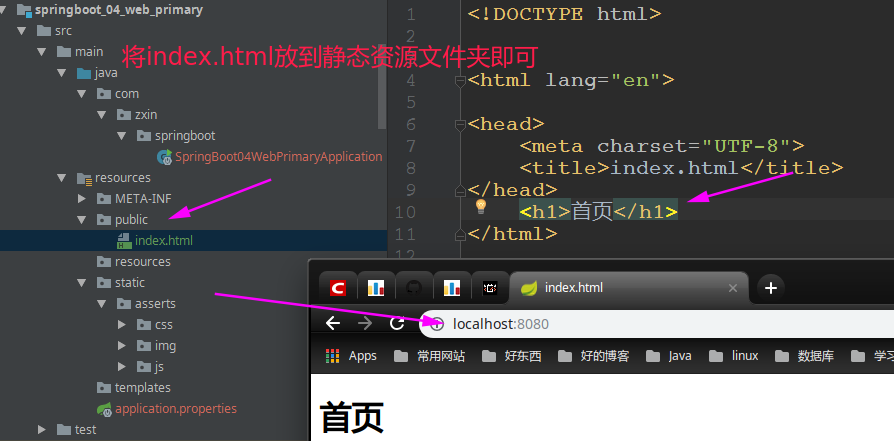

4）、所有的 `**/favicon.ico`  都是在静态资源文件下找；

下面是`WebMVCAutoConfiguration`里面的内部类`FaviconConfiguration`: 

```java
@Configuration
@ConditionalOnProperty(
    value = {"spring.mvc.favicon.enabled"},
    matchIfMissing = true
)
public static class FaviconConfiguration implements ResourceLoaderAware {
    private final ResourceProperties resourceProperties;
    private ResourceLoader resourceLoader;

    public FaviconConfiguration(ResourceProperties resourceProperties) {
        this.resourceProperties = resourceProperties;
    }

    public void setResourceLoader(ResourceLoader resourceLoader) {
        this.resourceLoader = resourceLoader;
    }

    @Bean
    public SimpleUrlHandlerMapping faviconHandlerMapping() {
        SimpleUrlHandlerMapping mapping = new SimpleUrlHandlerMapping();
        mapping.setOrder(-2147483647);
        // 所有的**/favicon.ico,还是在静态资源文件夹
        mapping.setUrlMap(Collections.singletonMap("**/favicon.ico", this.faviconRequestHandler()));
        return mapping;
    }

    @Bean
    public ResourceHttpRequestHandler faviconRequestHandler() {
        ResourceHttpRequestHandler requestHandler = new ResourceHttpRequestHandler();
        requestHandler.setLocations(this.resolveFaviconLocations());
        return requestHandler;
    }

    private List<Resource> resolveFaviconLocations() {
        String[] staticLocations = WebMvcAutoConfiguration.WebMvcAutoConfigurationAdapter.getResourceLocations(this.resourceProperties.getStaticLocations());
        List<Resource> locations = new ArrayList(staticLocations.length + 1);
        Stream var10000 = Arrays.stream(staticLocations);
        ResourceLoader var10001 = this.resourceLoader;
        this.resourceLoader.getClass();
        var10000.map(var10001::getResource).forEach(locations::add);
        locations.add(new ClassPathResource("/"));
        return Collections.unmodifiableList(locations);
    }
}
```

测试: 将`favicon.ico`放在`META-INF/resources`下(也是静态资源文件夹):

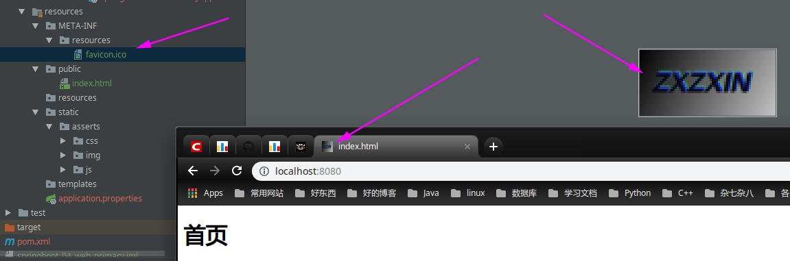


### 3、模板引擎thymeleaf

模板引擎的作用: 将页面模板和组装的数据交给模板引擎，模板引擎将页面中的表达式解析，填充到指定的位置，生成我们想要的内容。


SpringBoot推荐`Thymeleaf`，语法更简单，功能更强大。

**(1)、引入thymeleaf**

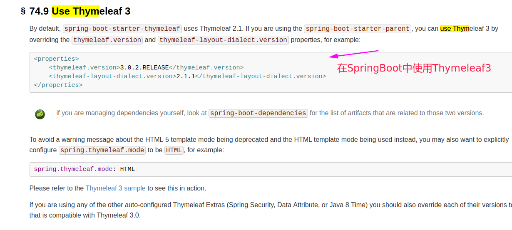

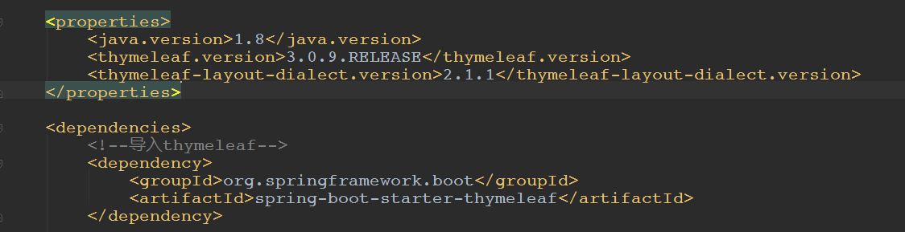

```xml
<properties>
    <java.version>1.8</java.version>
    <thymeleaf.version>3.0.9.RELEASE</thymeleaf.version>
    <!--布局功能的支持程序: thymeleaf3 == layout2版本-->
    <!--                thymeleaf2 == layout1 版本-->
    <thymeleaf-layout-dialect.version>2.1.1</thymeleaf-layout-dialect.version>
</properties>

<dependencies>
    <!--导入thymeleaf-->
    <dependency>
        <groupId>org.springframework.boot</groupId>
        <artifactId>spring-boot-starter-thymeleaf</artifactId>
    </dependency>
</dependencies>
```

但是像上面那样配置之后项目启动会出错:

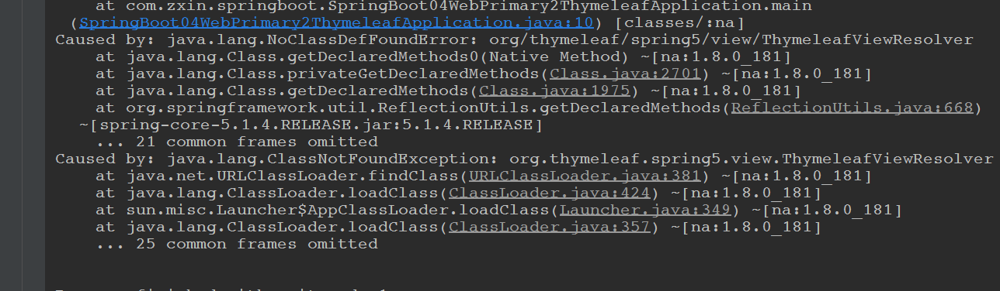

原因就是不能自己覆盖那个版本，但是教程上覆盖貌似是可以。。

[解决错误博客](https://blog.csdn.net/qinxian20120/article/details/80271094)

所以`pom.xml`还是不能将`thymeleaf`的版本更改，直接用`springboot`默认的版本即可。

测试结果: (**`classpath:/tmplates/success.html`**)

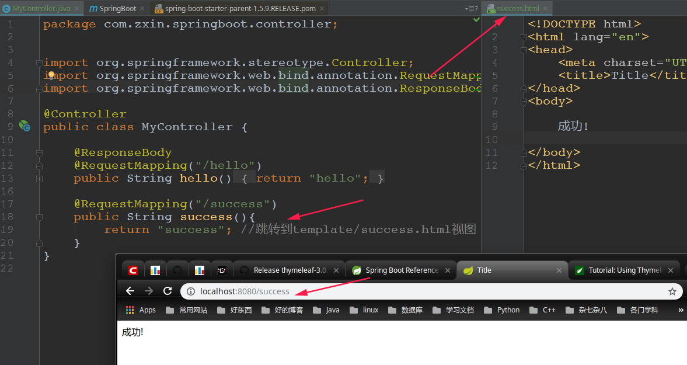

**(2)、Thymeleaf使用**

默认规则: 

```java
@ConfigurationProperties(prefix = "spring.thymeleaf")
public class ThymeleafProperties {

	private static final Charset DEFAULT_ENCODING = Charset.forName("UTF-8");

	private static final MimeType DEFAULT_CONTENT_TYPE = MimeType.valueOf("text/html");

	public static final String DEFAULT_PREFIX = "classpath:/templates/";

	public static final String DEFAULT_SUFFIX = ".html";
  	//
}
```

**只要我们把HTML页面放在`classpath:/templates/`，`thymeleaf`就能自动渲染；**

使用：

1、导入`thymeleaf`的名称空间

```xml
<html lang="en" xmlns:th="http://www.thymeleaf.org">
```

> 一个关于IDE的问题: [Thymeleaf在IDEA中的红色波浪线问题](https://blog.csdn.net/wifi74262580/article/details/82833017)

2、使用`thymeleaf`语法；

```html
<!DOCTYPE html>
<!--suppress ALL--> <!--解决thymeleaf红线问题-->
<html lang="en" xmlns:th="http://www.thymeleaf.org">
<head>
    <meta charset="UTF-8">
    <title>Title</title>
</head>
<body>

    <h1>成功!</h1>
    <!--th:text将div里面的内容设置成-->
    <div th:text="${hello}">这是显示欢迎信息</div> <!--后面的"这是显示欢迎信息"经过模板引擎解析后不会显示出来-->
</body>
</html>
```

**(3)、语法规则**

[**在线教程**](https://www.thymeleaf.org/doc/tutorials/3.0/usingthymeleaf.html)

1）、`th:text`；改变当前元素里面的文本内容；

`th`：任意`html`属性；来替换原生属性的值

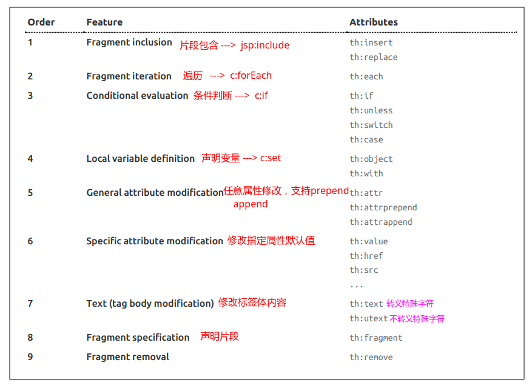


2）、表达式语法

具体参见: [在线文档](https://www.thymeleaf.org/doc/tutorials/3.0/usingthymeleaf.html#standard-expression-syntax)

1）、获取对象的属性、调用方法；
2）、使用内置的基本对象；
3）、内置的一些工具对象；

Simple expressions:

* Variable Expressions: `${...}`
* Selection Variable Expressions: `*{...}`
* Message Expressions: #{...}
* Link URL Expressions: @{...}
* Fragment Expressions: ~{...}

Literals(字面值)

* Text literals: 'one text' , 'Another one!' ,…
* Number literals: 0 , 34 , 3.0 , 12.3 ,…
* Boolean literals: true , false
* Null literal: null
* Literal tokens: one , sometext , main ,…

Text operations:（文本操作）

* String concatenation: +
* Literal substitutions: |The name is ${name}|

Arithmetic operations:(算数运算)

* Binary operators: + , - , * , / , %
* Minus sign (unary operator): -

Boolean operations:(布尔运算)

* Binary operators: and , or
* Boolean negation (unary operator): ! , not

Comparisons and equality:(比较运算)

* Comparators: > , < , >= , <= ( gt , lt , ge , le )
* Equality operators: == , != ( eq , ne )

Conditional operators:(条件运算)

* If-then: (if) ? (then)
* If-then-else: (if) ? (then) : (else)
* Default: (value) ?: (defaultvalue)

Special tokens:

* No-Operation: 

```properties
补充：        
    Selection Variable Expressions: *{...}：选择表达式：和${}在功能上是一样；
    配合 th:object="${session.user}：
    <div th:object="${session.user}">
        <p>Name: <span th:text="*{firstName}">Sebastian</span>.</p>
        <p>Surname: <span th:text="*{lastName}">Pepper</span>.</p>
        <p>Nationality: <span th:text="*{nationality}">Saturn</span>.</p>
    </div>

    Message Expressions: #{...}：获取国际化内容
    Link URL Expressions: @{...}：定义URL；
    @{/order/process(execId=${execId},execType='FAST')}
    Fragment Expressions: ~{...}：片段引用表达式
    <div th:insert="~{commons :: main}">...</div>
```
简单使用测试: 

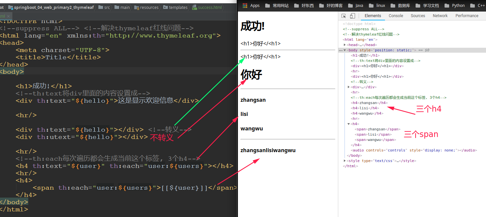

相关代码: 

`Controller`:

```java
@Controller
public class MyController {

    @ResponseBody
    @RequestMapping("/hello")
    public String hello(){
        return "hello";
    }

    @RequestMapping("/success")
    public String success(Map<String, Object> map){
        map.put("hello", "<h1>你好</<h1>");
        map.put("users", Arrays.asList("zhangsan", "lisi", "wangwu"));
        return "success"; //跳转到template/success.html视图
    }
}
```

`success.html`:

```html
<!DOCTYPE html>
<!--suppress ALL--> <!--解决thymeleaf红线问题-->
<html lang="en" xmlns:th="http://www.thymeleaf.org">
<head>
    <meta charset="UTF-8">
    <title>Title</title>
</head>
<body>
    <h1>成功!</h1>
    <!--th:text将div里面的内容设置成-->
    <div th:text="${hello}">这是显示欢迎信息</div>

    <hr/>

    <div th:text="${hello}"></div> <!--转义-->
    <div th:utext="${hello}"></div>

    <hr/>
    <!--th:each每次遍历都会生成当前这个标签, 3个h4-->
    <h4 th:text="${user}" th:each="user:${users}"></h4>
    <hr/>
    <h4>
        <span th:each="user:${users}">[[${user}]]</span>
    </h4>
</body>
</html>
```

### 4、SpringMVC自动配置

#### (1)、SpringMVC Auto Configuration

[**在线文档参考**](https://docs.spring.io/spring-boot/docs/1.5.9.RELEASE/reference/htmlsingle/#boot-features-developing-web-applications)，**`org.springframework.boot.autoconfigure.web`：web的所有自动场景。**

Spring MVC auto-configuration，即SpringBoot自动配置好了SpringMVC，

- Inclusion of `ContentNegotiatingViewResolver` and `BeanNameViewResolver` beans.

  * 自动配置了`ViewResolver`（视图解析器：根据方法的返回值得到视图对象（View），视图对象决定如何渲染（转发？重定向？））  
  *  `ContentNegotiatingViewResolver`：组合所有的视图解析器的；
  * **如何定制：我们可以自己给容器中添加一个视图解析器；自动的将其组合进来；比如`MyViewResolver`；**

- Support for serving static resources, including support for WebJars (see below).静态资源文件夹路径,webjars等；

- Static `index.html` support. 静态首页访问

- Custom `Favicon` support (see below). ` favicon.ico`图标；

- 自动注册了 of `Converter`, `GenericConverter`, `Formatter` beans.

  - `Converter`：类型转换器；  public String hello(User user)：类型转换使用`Converter`
  - `Formatter`  格式化器(例如日期格式化(和SpringMVC息息相关))；  2017.12.17===Date；

```java
@Bean
@ConditionalOnProperty(
    prefix = "spring.mvc",
    name = {"date-format"}//在配置文件中配置日期格式化规则
)
public Formatter<Date> dateFormatter() {
    return new DateFormatter(this.mvcProperties.getDateFormat());//日期格式化组件
}
```


**自己添加的格式化器转换器，我们只需要放在容器中即可。**

- Support for `HttpMessageConverters` (see below).

  - `HttpMessageConverter`：SpringMVC用来转换Http请求和响应的，例如想将User以Json方法写出去`User---Json`；

  - `HttpMessageConverters` 是从容器中确定；获取所有的HttpMessageConverter；

    **自己给容器中添加HttpMessageConverter，只需要将自己的组件注册容器中（@Bean,@Component）**

- Automatic registration of `MessageCodesResolver` (see below).定义错误代码生成规则；

- Automatic use of a `ConfigurableWebBindingInitializer` bean (see below).

  **我们可以配置一个ConfigurableWebBindingInitializer来替换默认的；（添加到容器）**--> 数据初始化绑定初始化`WebDataBinder；`


If you want to keep Spring Boot MVC features, and you just want to add additional [MVC configuration](https://docs.spring.io/spring/docs/4.3.14.RELEASE/spring-framework-reference/htmlsingle#mvc) (interceptors, formatters, view controllers etc.) you can add your own `@Configuration` class of type `WebMvcConfigurerAdapter`, but **without** `@EnableWebMvc`. If you wish to provide custom instances of `RequestMappingHandlerMapping`, `RequestMappingHandlerAdapter` or `ExceptionHandlerExceptionResolver` you can declare a `WebMvcRegistrationsAdapter` instance providing such components.

If you want to take complete control of Spring MVC, you can add your own `@Configuration` annotated with `@EnableWebMvc`.

#### (2)、扩展SpringMVC

以前的配置，视图解析`viewController`，以及拦截器(`interceptor`)。

```xml
<mvc:view-controller path="/hello" view-name="success"/>
<mvc:interceptors>
    <mvc:interceptor>
        <mvc:mapping path="/hello"/>
        <bean></bean>
    </mvc:interceptor>
</mvc:interceptors>
```

**编写一个配置类（@Configuration），是WebMvcConfigurerAdapter类型；不能标注@EnableWebMvc**;

既保留了所有的自动配置，也能用我们扩展的配置，下面是`SpringBoot1.0`以上的，但是现在过时了

```java
//使用WebMvcConfigurerAdapter可以来扩展SpringMVC的功能
@Configuration
public class MyMvcConfig extends WebMvcConfigurerAdapter {

    @Override
    public void addViewControllers(ViewControllerRegistry registry) {
       // super.addViewControllers(registry);
        //浏览器发送 /zxin 请求来到 success
        registry.addViewController("/zxin").setViewName("success");
    }
}
```

[相关博客解释1](https://blog.csdn.net/qq_38164123/article/details/80392904)

[相关博客解释2](http://blog.51cto.com/12066352/2093750)

`SpringBoot2.0`以上的替代方案: 

```java
// 以前是使用 WebMvcConfigurerAdapter扩展SpringMVC的功能
@Configuration
public class MyMvcConfig implements WebMvcConfigurer {

    @Override
    public void addViewControllers(ViewControllerRegistry registry) {
        //浏览器发送 /zxin请求，来到 success.html页面
        registry.addViewController("/zxin").setViewName("success");
    }
}
```

原理：

​	1）、`WebMvcAutoConfiguration`是SpringMVC的自动配置类；

​	2）、在做其他自动配置时会导入；`@Import(EnableWebMvcConfiguration.class)`

```java
    @Configuration
	public static class EnableWebMvcConfiguration extends DelegatingWebMvcConfiguration {
      private final WebMvcConfigurerComposite configurers = new WebMvcConfigurerComposite();
	 //下面的代码是 DelegatingWebMvcConfiguration(父类)中的, 从容器中获取所有的WebMvcConfigurer
      @Autowired(required = false)
      public void setConfigurers(List<WebMvcConfigurer> configurers) {
          if (!CollectionUtils.isEmpty(configurers)) {
              this.configurers.addWebMvcConfigurers(configurers);
               //一个参考实现；将所有的WebMvcConfigurer相关配置都来一起调用；  
           	   //@Override
               // public void addViewControllers(ViewControllerRegistry registry) {
               //    for (WebMvcConfigurer delegate : this.delegates) {
               //       delegate.addViewControllers(registry);
               //   }
              }
          }
	}
```

​	3）、容器中所有的`WebMvcConfigurer`都会一起起作用；

​	4）、我们的配置类也会被调用；

效果：SpringMVC的自动配置和我们的扩展配置都会起作用；

#### (3)、全面接管SpringMVC

> 这个就是当你标注了`@EnableWebMvc`注解，就可以完全的控制SpringMVC了(SpringBoot对SpringMVC不会起作用了)。

SpringBoot对SpringMVC的自动配置不需要了，所有都是我们自己配置；所有的SpringMVC(`web`场景)的自动配置都失效了。

**我们需要在配置类中添加@EnableWebMvc即可；**

```java
@EnableWebMvc // 全面接管SpringMVC，静态资源都不能访问了
@Configuration
public class MyMvcConfig implements WebMvcConfigurer {
    @Override
    public void addViewControllers(ViewControllerRegistry registry) {
        registry.addViewController("/zxin").setViewName("success");
    }
}
```

原理：

为什么`@EnableWebMvc`自动配置就失效了；

1）、@EnableWebMvc的核心

```java
@Import({DelegatingWebMvcConfiguration.class}) //核心
public @interface EnableWebMvc {
}

```

2）、导入的`DelegatingWebMvcConfiguration`类: 

```java
@Configuration
public class DelegatingWebMvcConfiguration extends WebMvcConfigurationSupport {
}
```

3）、而`WebMvcAutoConfiguration`类的开始是这样写的: 关键就在这一行`@ConditionalOnMissingBean({WebMvcConfigurationSupport.class})`

```java
@Configuration
@ConditionalOnWebApplication(
    type = Type.SERVLET
)
@ConditionalOnClass({Servlet.class, DispatcherServlet.class, WebMvcConfigurer.class})
//容器中没有这个组件的时候，这个自动配置类才生效，但是如果上面有了，就不生效了,所以这就是原因
@ConditionalOnMissingBean({WebMvcConfigurationSupport.class})
@AutoConfigureOrder(-2147483638)
@AutoConfigureAfter({DispatcherServletAutoConfiguration.class, TaskExecutionAutoConfiguration.class, ValidationAutoConfiguration.class})
public class WebMvcAutoConfiguration {
}
```

4）、@EnableWebMvc将`WebMvcConfigurationSupport`组件导入进来；

5）、而导入的`WebMvcConfigurationSupport`只是SpringMVC**最基本**的功能；

### 5、如何修改SpringBoot的默认配置

模式：

​	1）、SpringBoot在自动配置很多组件的时候，先看容器中有没有用户自己配置的（`@Bean、@Component`）如果有就用用户配置的，如果没有，才自动配置；如果有些组件可以有多个（`ViewResolver`）将用户配置的和自己默认的组合起来；

​	2）、在SpringBoot中会有非常多的`xxxConfigurer`帮助我们进行扩展配置；

​	3）、在SpringBoot中会有很多的`xxxCustomizer`帮助我们进行定制配置；


### 6、Restful-CRUD

#### (1)、默认访问首页

如果我们在静态资源文件夹(`public、META-INF/resources、resources、static`)中放了`index.html`页面，就不会默认访问到我们在`template`下面的首页，有两种方法可以解决这个问题。

方法一:

```java
@Controller
public class IndexController {

    @RequestMapping({"/", "/index.html"})
    public String index(){
        return "login";// 跳转到template/login.html
    }
}
```

方法二:

```java
@Configuration
public class MyMvcConfig implements WebMvcConfigurer{

    @Override
    public void addViewControllers(ViewControllerRegistry registry) {
        registry.addViewController("/").setViewName("login");
        registry.addViewController("/index.html").setViewName("login");
    }
}

```

另外，可以用`Thymeleaf`来替换`login.html`中的一些代码。这样，当改变项目名称时不会受影响。

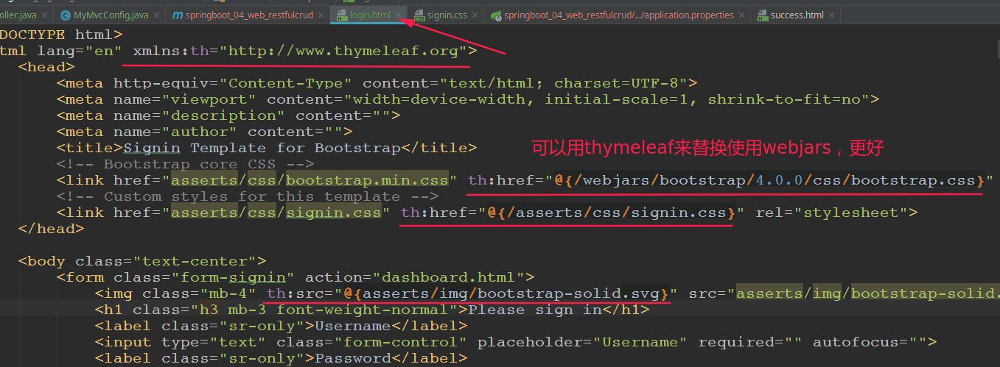

#### (2)、国际化

以前SpringMVC的配置步骤: 

**1）、编写国际化配置文件；**

2）、使用ResourceBundleMessageSource管理国际化资源文件；

3）、在页面使用fmt:message取出国际化内容；


现在SpringBoot帮我们做好了后面的两项。我们只需要编写配置文件即可。

步骤：

1）、编写国际化配置文件，抽取页面需要显示的国际化消息；

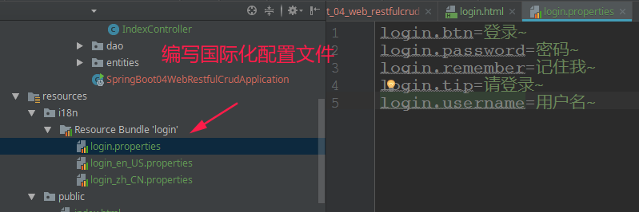

2）、SpringBoot自动配置好了管理国际化资源文件的组件`MessageSourceAutoConfiguration`；

```java
@ConfigurationProperties(prefix = "spring.messages")
public class MessageSourceAutoConfiguration {
    
    /**
	 * Comma-separated list of basenames (essentially a fully-qualified classpath
	 * location), each following the ResourceBundle convention with relaxed support for
	 * slash based locations. If it doesn't contain a package qualifier (such as
	 * "org.mypackage"), it will be resolved from the classpath root.
	 */
	private String basename = "messages";  
    //我们的配置文件可以直接放在类路径下叫messages.properties；
    
    @Bean
	public MessageSource messageSource() {
		ResourceBundleMessageSource messageSource = new ResourceBundleMessageSource();
		if (StringUtils.hasText(this.basename)) {
            //设置国际化资源文件的基础名（去掉语言国家代码的en_US） 默认是message
			messageSource.setBasenames(StringUtils.commaDelimitedListToStringArray(
					StringUtils.trimAllWhitespace(this.basename)));
		}
		if (this.encoding != null) {
			messageSource.setDefaultEncoding(this.encoding.name());
		}
		messageSource.setFallbackToSystemLocale(this.fallbackToSystemLocale);
		messageSource.setCacheSeconds(this.cacheSeconds);
		messageSource.setAlwaysUseMessageFormat(this.alwaysUseMessageFormat);
		return messageSource;
	}
}
```

3）、编写配置基础名的配置文件代码；

```properties
spring.messages.basename=i18n.login
```

4）、去页面获取国际化的值；

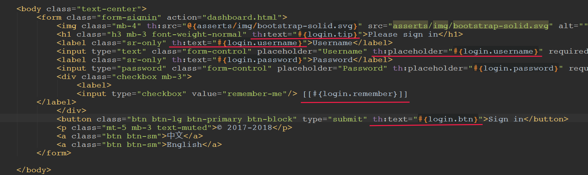

`login.html`完整代码:

```html
<!DOCTYPE html>
<html lang="en" xmlns:th="http://www.thymeleaf.org">
	<head>
		<meta http-equiv="Content-Type" content="text/html; charset=UTF-8">
		<meta name="viewport" content="width=device-width, initial-scale=1, shrink-to-fit=no">
		<meta name="description" content="">
		<meta name="author" content="">
		<title>Signin Template for Bootstrap</title>
		<!-- Bootstrap core CSS -->
		<link href="asserts/css/bootstrap.min.css" th:href="@{/webjars/bootstrap/4.0.0/css/bootstrap.css}" rel="stylesheet">
		<!-- Custom styles for this template -->
		<link href="asserts/css/signin.css" th:href="@{/asserts/css/signin.css}" rel="stylesheet">
	</head>

	<body class="text-center">
		<form class="form-signin" action="dashboard.html">
			
			<h1 class="h3 mb-3 font-weight-normal" th:text="#{login.tip}">Please sign in</h1>
			<label class="sr-only" th:text="#{login.username}">Username</label>
			<input type="text" class="form-control" placeholder="Username" th:placeholder="#{login.username}" required="" autofocus="">
			<label class="sr-only" th:text="#{login.password}">Password</label>
			<input type="password" class="form-control" placeholder="Password" th:placeholder="#{login.password}" required="">
			<div class="checkbox mb-3">
				<label>
          		<input type="checkbox" value="remember-me"/> [[#{login.remember}]]
        </label>
			</div>
			<button class="btn btn-lg btn-primary btn-block" type="submit" th:text="#{login.btn}">Sign in</button>
			<p class="mt-5 mb-3 text-muted">© 2017-2018</p>
			<a class="btn btn-sm">中文</a>
			<a class="btn btn-sm">English</a>
		</form>

	</body>

</html>
```

效果：根据浏览器语言设置的信息切换了国际化；

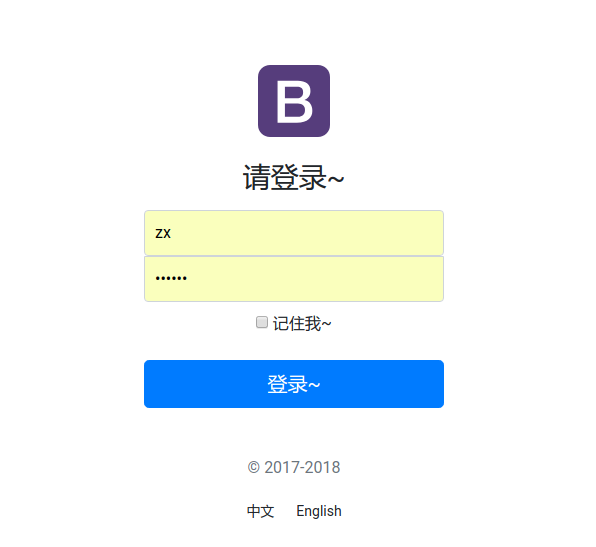

原理：

​	国际化`Locale`（区域信息对象）；`LocaleResolver`（获取区域信息对象）；

```java
@Bean
@ConditionalOnMissingBean
@ConditionalOnProperty(
    prefix = "spring.mvc",
    name = {"locale"}
)
public LocaleResolver localeResolver() {
    if (this.mvcProperties.getLocaleResolver() == org.springframework.boot.autoconfigure.web.servlet.WebMvcProperties.LocaleResolver.FIXED) {
        return new FixedLocaleResolver(this.mvcProperties.getLocale());
    } else {
        AcceptHeaderLocaleResolver localeResolver = new AcceptHeaderLocaleResolver();
        localeResolver.setDefaultLocale(this.mvcProperties.getLocale());
        return localeResolver;
    }
}
// 默认的就是根据 请求头 带来的区域信息获取Locale进行国际化
```

4）、可以配置自己的`LocaleResolver`点击链接切换国际化

`login.html`更改:


```java
/**
 * 可以在链接上携带区域信息
 */
public class MyLocaleResolver implements LocaleResolver{

    // 解析区域信息
    @Override
    public Locale resolveLocale(HttpServletRequest request) {
        String l = request.getParameter("l");
        Locale locale = Locale.getDefault();
        if(!StringUtils.isEmpty(l)){
            String[] split = l.split("_");
            locale = new Locale(split[0], split[1]);// public Locale(String language, String country)
        }
        return locale;
    }

    @Override
    public void setLocale(HttpServletRequest httpServletRequest, @Nullable HttpServletResponse httpServletResponse, @Nullable Locale locale) {

    }
}

```
最后记得要注册这个组件。

```java
// 注册组件
@Bean
public LocaleResolver localeResolver(){
    return new MyLocaleResolver();
}
```

#### (3)、登陆

**开发期间模板引擎页面修改以后，要实时生效：**

1）、禁用模板引擎的缓存；

```properties
# 禁用模板引擎的缓存 (这样就不会在更改html代码的时候没有立即显示改变)，然后IDEA CTRL + F9重新编译一下
spring.thymeleaf.cache=false
```

2）、页面修改完成以后`ctrl+f9`：重新编译；


**实现登录的前端代码，在`form`表单添加`action`：**

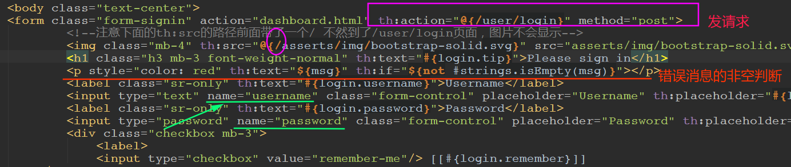

具体代码:

```html
<body class="text-center">
		<form class="form-signin" action="dashboard.html" th:action="@{/user/login}" method="post">
			<!--注意下面的th:src的路径前面带了一个/ 不然到了/user/login页面，图片不会显示-->
			
			<h1 class="h3 mb-3 font-weight-normal" th:text="#{login.tip}">Please sign in</h1>
			<p style="color: red" th:text="${msg}" th:if="${not #strings.isEmpty(msg)}"></p>
			<label class="sr-only" th:text="#{login.username}">Username</label>
			<input type="text" name="username" class="form-control" placeholder="Username" th:placeholder="#{login.username}" required="" autofocus="">
			<label class="sr-only" th:text="#{login.password}">Password</label>
			<input type="password" name="password" class="form-control" placeholder="Password" th:placeholder="#{login.password}" required="">
			<div class="checkbox mb-3">
				<label>
          		<input type="checkbox" value="remember-me"/> [[#{login.remember}]]
        </label>
			</div>
			<button class="btn btn-lg btn-primary btn-block" type="submit" th:text="#{login.btn}">Sign in</button>
			<p class="mt-5 mb-3 text-muted">© 2017-2018</p>
			<a class="btn btn-sm" th:href="@{/index.html(l='zh_CN')}">中文</a>
			<a class="btn btn-sm" th:href="@{/index.html(l='en_US')}">English</a>
		</form>
	</body>

```

登陆错误消息的显示

```html
<p style="color: red" th:text="${msg}" th:if="${not #strings.isEmpty(msg)}"></p>
```
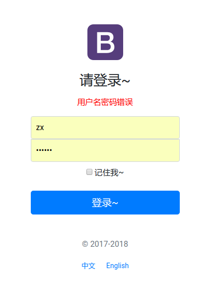


后台`Java`代码:

```java
@Controller
public class LoginController {

//    @GetMapping
//    @PutMapping
//    @DeleteMapping
//    @RequestMapping(value = "/user/login", method = RequestMethod.POST) //太长
    @PostMapping(value = "/user/login")
    public String login(@RequestParam("username") String username,
                        @RequestParam("password") String password,
                        Map<String, Object>map){
        if(!StringUtils.isEmpty(username) && "123456".equals(password)){
            return "dashboard";
        }else {
            // 登录失败
            map.put("msg", "用户名密码错误");
            return "login";
        }
    }
}

```


**防止表单的重复提交**

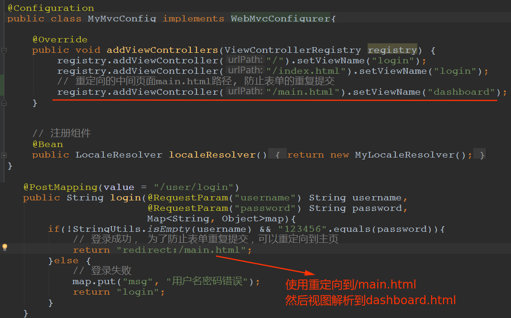

#### (4)、拦截器进行登录检查

**如果按照上面的处理(对重复提交表单的处理)会发生你登录之后在另一个浏览器中不需要登录可以直接访问`dashboard.html(main.html)`的情况，所以要使用拦截器`interceptor`进行拦截器检查。**

自已定义一个`LoginHandlerInterceptor`

```java
/**
 * 登录检查
 */
public class LoginHandlerInterceptor implements HandlerInterceptor {

    //目标方法执行之前
    @Override
    public boolean preHandle(HttpServletRequest request, HttpServletResponse response, Object handler) throws Exception {
        Object user = request.getSession().getAttribute("loginUser");
        if(user == null){
            // 未登录，返回登录页面
            request.setAttribute("msg", "没有权限，请先登录");
            request.getRequestDispatcher("/index.html").forward(request, response);
            return false;
        }else {
            //已登录, 放行请求
            return true;
        }
    }
    @Override
    public void postHandle(HttpServletRequest request, HttpServletResponse response, Object handler, @Nullable ModelAndView modelAndView) throws Exception {

    }
    @Override
    public void afterCompletion(HttpServletRequest request, HttpServletResponse response, Object handler, @Nullable Exception ex) throws Exception {

    }
}

```

在MVC的配置类`MyMvcConfig`注册拦截器:

```java
// 注册拦截器
@Override
public void addInterceptors(InterceptorRegistry registry) {
    // 除了  "/index.html", "/", "/user/login"  都要拦截
    // 以前SpringMVC还需要配置： 不能拦截静态资源，
    // 现在SpringBoot已经做好了不拦截静态资源的配置
    registry.addInterceptor(new LoginHandlerInterceptor()).addPathPatterns("/**")
        .excludePathPatterns("/index.html", "/", "/user/login"
                            );
}
    }
```

效果:

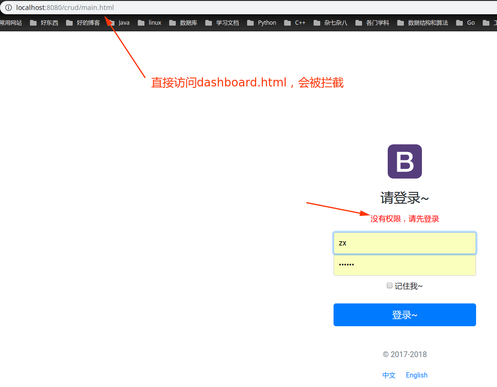

#### (5)、CRUD员工列表

实验要求：

1）、`RestfulCRUD`：CRUD满足`Rest`风格；

**URI：  /资源名称/资源标识    :  HTTP请求方式区分对资源CRUD操作**

|      | 普通CRUD（uri来区分操作） | RestfulCRUD       |
| ---- | :------------------------ | ----------------- |
| 查询 | getEmp                    | emp---GET         |
| 添加 | addEmp?xxx                | emp---POST        |
| 修改 | updateEmp?id=xxx&ooo=xx   | emp/{id}---PUT    |
| 删除 | deleteEmp?id=1            | emp/{id}---DELETE |

2）、实验的请求架构;

| 实验功能                             | 请求URI             | 请求方式   |
| ------------------------------------ | ------------------- | ---------- |
| 查询所有员工                         | `emps`              | GET        |
| 查询某个员工(来到修改页面)           | `emp/1`(`emp/{id}`) | GET        |
| 来到添加页面                         | emp                 | GET        |
| 添加员工                             | emp                 | **POST**   |
| 来到修改页面（查出员工进行信息回显） | emp/1               | GET        |
| 修改员工                             | emp                 | **PUT**    |
| 删除员工                             | emp/1               | **DELETE** |

3）、员工列表：

**`thymeleaf`公共页面元素抽取(因为员工列表页面list.html的顶部和左边都是和dashboard.html相同，所以可以将公共部分抽取出来)**

```html
1、抽取公共片段
<div th:fragment="copy">
&copy; 2011 The Good Thymes Virtual Grocery
</div>

2、引入公共片段
<div th:insert="~{footer :: copy}"></div>
~{templatename::selector}：模板名::选择器
~{templatename::fragmentname}:模板名::片段名

3、默认效果：
insert的公共片段在div标签中
如果使用th:insert等属性进行引入，可以不用写~{}：
行内写法可以(必须)加上：[[~{}]];[(~{})]；
```
三种引入公共片段的th属性：

**th:insert**：将公共片段整个插入到声明引入的元素中

**th:replace**：将声明引入的元素替换为公共片段

**th:include**：将被引入的片段的内容包含进这个标签中

```html
<footer th:fragment="copy">
&copy; 2011 The Good Thymes Virtual Grocery
</footer>

引入方式
<div th:insert="footer :: copy"></div>
<div th:replace="footer :: copy"></div>
<div th:include="footer :: copy"></div>

效果
1. insert
<div>
    <footer>
    &copy; 2011 The Good Thymes Virtual Grocery
    </footer>
</div>
2. replace
<footer>
&copy; 2011 The Good Thymes Virtual Grocery
</footer>
3. th:include
<div>
&copy; 2011 The Good Thymes Virtual Grocery
</div>
```


`dashboard.html`顶部公共元素抽取:

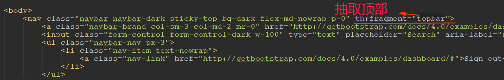

在`list.html`中引入:

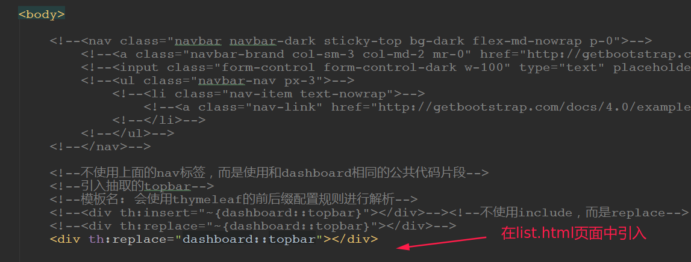

`dashboard.html`侧栏公共元素抽取:

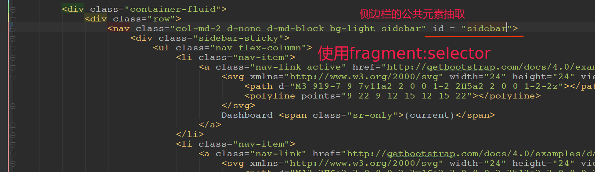

在`list.html`中引入:

先删除原来的`nav`标签(侧栏):

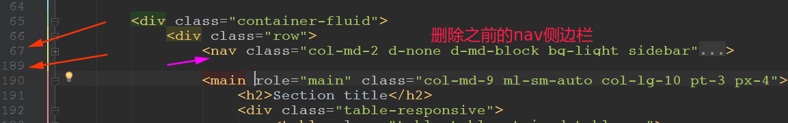

引入新的:

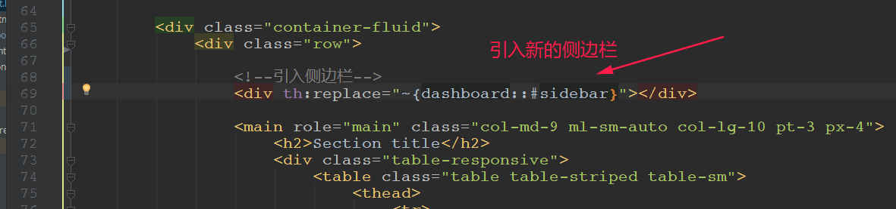


**引入片段的时候传入参数：** (**这个解决的就是侧栏的点击高亮问题(当前选项高亮)**)

此时将公共部分抽取出来`bar.html`(不是将公共部分继续放在`dashboard.html`中):

(1).`bar.html`中添加`th:class`属性判断(带参数)

```html
DashBoard部分
<li class="nav-item">
     <a class="nav-link active"
        th:class="${activeUri=='main.html'?'nav-link active':'nav-link'}"<!--重要-->
        href="#" th:href="@{/main.html}">
         <svg xmlns="http://www.w3.org/2000/svg" width="24" height="24" viewBox="0 0 24 24" fill="none" stroke="currentColor" stroke-width="2" stroke-linecap="round" stroke-linejoin="round" class="feather feather-home">
             <path d="M3 9l9-7 9 7v11a2 2 0 0 1-2 2H5a2 2 0 0 1-2-2z"></path>
             <polyline points="9 22 9 12 15 12 15 22"></polyline>
         </svg>
         Dashboard <span class="sr-only">(current)</span>
     </a>
</li>

员工管理部分
 <li class="nav-item">
     <a class="nav-link" href="#" th:href="@{/emps}"
        th:class="${activeUri=='emps'?'nav-link active':'nav-link'}"> <!--发送restful式的请求，查看所有的员工-->
         <svg xmlns="http://www.w3.org/2000/svg" width="24" height="24" viewBox="0 0 24 24" fill="none" stroke="currentColor" stroke-width="2" stroke-linecap="round" stroke-linejoin="round" class="feather feather-users">
             <path d="M17 21v-2a4 4 0 0 0-4-4H5a4 4 0 0 0-4 4v2"></path>
             <circle cx="9" cy="7" r="4"></circle>
             <path d="M23 21v-2a4 4 0 0 0-3-3.87"></path>
             <path d="M16 3.13a4 4 0 0 1 0 7.75"></path>
         </svg>
         员工管理
     </a>
</li>
```

(2). `list.html`和`dashboard.html`引入更改:

```html
list.html
<!--引入公共部分topbar-->
<div th:replace="commons/bar::topbar"></div>
<div class="container-fluid">
    <div class="row">
        <!--引入侧边栏-->
        <!--<div th:replace="~{dashboard::#sidebar}"></div>-->
        <div th:replace="commons/bar::#sidebar(activeUri='emps')"></div>
        
        
dashboard.html    
<!--引入公共部分topbar-->
<div th:replace="commons/bar::topbar"></div>
<div class="container-fluid">
	<div class="row">
<!--引入公共部分sidebar-->
		<div th:replace="commons/bar::#sidebar(activeUri='main.html')"></div>              
```

`list.html`页面员工展示:

```html
<div class="table-responsive">
    <table class="table table-striped table-sm">
        <thead>
            <tr>
                <th>#</th>
                <th>lastName</th>
                <th>email</th>
                <th>gender</th>
                <th>department</th>
                <th>birth</th>
                <th>操作</th>
            </tr>
        </thead>

        <tbody>
            <tr th:each="emp:${emps}">
                <td th:text="${emp.id}"></td>
                <td>[[${emp.lastName}]]</td>
                <td th:text="${emp.email}"></td>
                <td th:text="${emp.gender}==0?'女':'男'"</td>
                <td th:text="${emp.department.departmentName}"></td>
                <!--<td th:text="${emp.birth}"></td>-->
                <!--日期格式化-->
                <td th:text="${#dates.format(emp.birth, 'yyyy-MM-dd HH:mm')}"></td>
                <td>
                    <!--小号的蓝颜色的bootstrap的按钮-->
                    <button class="btn btn-sm btn-primary">编辑</button>
                    <!--小号的红颜色的bootstrap的按钮-->
                    <button class="btn btn-sm btn-danger">删除</button>
                </td>
            </tr>
        </tbody>

    </table>
</div>
```

效果:

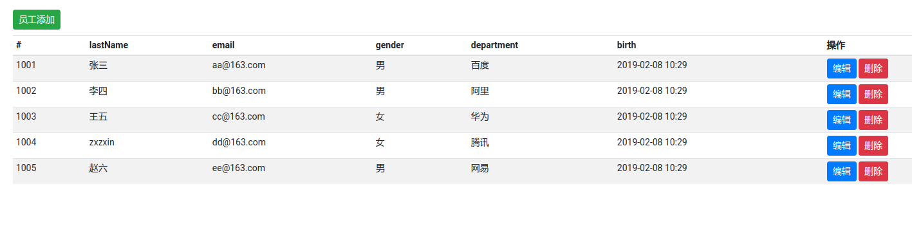

#### (6)、CRUD员工添加

`list`页面添加按钮:

```html
<h2><a class="btn btn-sm btn-success" href="emp" th:href="@{/emp}">员工添加</a></h2>
```


`controlloer`:

```java
//来到员工添加页面
@GetMapping("/emp")
public String toAddPage(Model model){

    //来到添加页面, 需要所有的部门，在页面显示
    Collection<Department> departments = departmentDao.getDepartments();
    model.addAttribute("depts", departments);

    return "emp/add";
}
```

`add.html`页面中的表单添加页面

```html
<main role="main" class="col-md-9 ml-sm-auto col-lg-10 pt-3 px-4">

    <!--不是之前的list.html的内容，而是一个表单添加员工-->
    <!--表单在bootstrap中有-->
    <form>
        <div class="form-group">
            <label>LastName</label>
            <input type="text" class="form-control" placeholder="zhangsan">
        </div>
        <div class="form-group">
            <label>Email</label>
            <input type="email" class="form-control" placeholder="zhangsan@163.com">
        </div>
        <div class="form-group">
            <label>Gender</label><br/>
            <div class="form-check form-check-inline">
                <input class="form-check-input" type="radio" name="gender"  value="1">
                <label class="form-check-label">男</label>
            </div>
            <div class="form-check form-check-inline">
                <input class="form-check-input" type="radio" name="gender"  value="0">
                <label class="form-check-label">女</label>
            </div>
        </div>
        <div class="form-group">
            <label>department</label>
            <select class="form-control">
                <!--提交的是部门的id-->
                <option th:value="dept.id" th:each="dept:${depts}" th:text="${dept.departmentName}">1</option>
            </select>
        </div>
        <div class="form-group">
            <label>Birth</label>
            <input type="text" class="form-control" placeholder="2001-01-01">
        </div>
        <button type="submit" class="btn btn-primary">添加</button>
    </form>

</main>
```

提交的数据格式不对：生日：日期；

2017-12-12；2017/12/12；2017.12.12；

配置(`application.properties`中配置)

```properties
# 日期格式化
spring.mvc.date-format=yyyy-MM-dd
```

日期的格式化；SpringMVC将页面提交的值需要转换为指定的类型;

2017-12-12---Date； 类型转换，格式化;

**默认日期是按照/的方式；**

#### (7)、CRUD员工修改

**修改添加二合一表单**

```html
<!--需要区分是员工修改还是添加；-->
<form th:action="@{/emp}" method="post">
    <!--发送put请求修改员工数据-->
    <!--
1、SpringMVC中配置HiddenHttpMethodFilter;（SpringBoot自动配置好的）
2、页面创建一个post表单
3、创建一个input项，name="_method";值就是我们指定的请求方式
-->
    <input type="hidden" name="_method" value="put" th:if="${emp!=null}"/>
    <input type="hidden" name="id" th:if="${emp!=null}" th:value="${emp.id}">
    <div class="form-group">
        <label>LastName</label>
        <input name="lastName" type="text" class="form-control" placeholder="zhangsan" th:value="${emp!=null}?${emp.lastName}">
    </div>
    <div class="form-group">
        <label>Email</label>
        <input name="email" type="email" class="form-control" placeholder="zhangsan@atguigu.com" th:value="${emp!=null}?${emp.email}">
    </div>
    <div class="form-group">
        <label>Gender</label><br/>
        <div class="form-check form-check-inline">
            <input class="form-check-input" type="radio" name="gender" value="1" th:checked="${emp!=null}?${emp.gender==1}">
            <label class="form-check-label">男</label>
        </div>
        <div class="form-check form-check-inline">
            <input class="form-check-input" type="radio" name="gender" value="0" th:checked="${emp!=null}?${emp.gender==0}">
            <label class="form-check-label">女</label>
        </div>
    </div>
    <div class="form-group">
        <label>department</label>
        <!--提交的是部门的id-->
        <select class="form-control" name="department.id">
            <option th:selected="${emp!=null}?${dept.id == emp.department.id}" th:value="${dept.id}" th:each="dept:${depts}" th:text="${dept.departmentName}">1</option>
        </select>
    </div>
    <div class="form-group">
        <label>Birth</label>
        <input name="birth" type="text" class="form-control" placeholder="zhangsan" th:value="${emp!=null}?${#dates.format(emp.birth, 'yyyy-MM-dd HH:mm')}">
    </div>
    <button type="submit" class="btn btn-primary" th:text="${emp!=null}?'修改':'添加'">添加</button>
</form>
```

后台`java`代码:

来到修改页面代码:

```javascript
//来到修改页面，查出当前员工，在页面回显
@GetMapping("/emp/{id}")
public String toEditPage(@PathVariable("id") Integer id, Model model){
    Employee employee = employeeDao.get(id);
    model.addAttribute("emp",employee);

    //页面要显示所有的部门列表
    Collection<Department> departments = departmentDao.getDepartments();
    model.addAttribute("depts",departments);
    //回到修改页面(add是一个修改添加二合一的页面);
    return "emp/add";
}
```

真正修改:


```java
//员工修改；需要提交员工id；
@PutMapping("/emp")
public String updateEmployee(Employee employee){
    System.out.println("修改的员工数据："+employee);
    employeeDao.save(employee);
    return "redirect:/emps";
}

```


#### (8)、CRUD员工删除

```html
<tr th:each="emp:${emps}">
    <td th:text="${emp.id}"></td>
    <td>[[${emp.lastName}]]</td>
    <td th:text="${emp.email}"></td>
    <td th:text="${emp.gender}==0?'女':'男'"></td>
    <td th:text="${emp.department.departmentName}"></td>
    <td th:text="${#dates.format(emp.birth, 'yyyy-MM-dd HH:mm')}"></td>
    <td>
        <a class="btn btn-sm btn-primary" th:href="@{/emp/}+${emp.id}">编辑</a>
        <button th:attr="del_uri=@{/emp/}+${emp.id}" class="btn btn-sm btn-danger deleteBtn">删除</button>
    </td>
</tr>

<script>
    $(".deleteBtn").click(function(){
        //删除当前员工的
        $("#deleteEmpForm").attr("action",$(this).attr("del_uri")).submit();
        return false;
    });
</script>
```

后台java代码:

```java
//员工删除
@DeleteMapping("/emp/{id}")
public String deleteEmployee(@PathVariable("id") Integer id){
    employeeDao.delete(id);
    return "redirect:/emps";
}
```


### 7、错误处理机制

#### (1)、SpringBoot默认的错误处理机制

默认效果，浏览器返回一个默认的错误页面

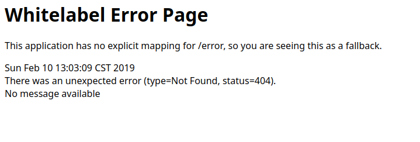

浏览器发送请求的请求头()：

如果是其他客户端，默认响应一个`json`数据(Postman客户端查看): 

```json
{
    "timestamp": "2019-02-10T05:04:15.852+0000",
    "status": 404,
    "error": "Not Found",
    "message": "No message available",
    "path": "/crud/aaa"
}
```

原理：

可以参照`ErrorMvcAutoConfiguration`；错误处理的自动配置；

 给容器中添加了以下组件: 

`1、DefaultErrorAttributes`：

```java
帮我们在页面共享信息；页面能获取的信息getErrorAttributes
@Override
	public Map<String, Object> getErrorAttributes(RequestAttributes requestAttributes,
			boolean includeStackTrace) {
		Map<String, Object> errorAttributes = new LinkedHashMap<String, Object>();
		errorAttributes.put("timestamp", new Date());
		addStatus(errorAttributes, requestAttributes);
		addErrorDetails(errorAttributes, requestAttributes, includeStackTrace);
		addPath(errorAttributes, requestAttributes);
		return errorAttributes;
	}
```

`2、BasicErrorController`：处理默认`/error`请求(可以在配置文件中配置)

这个就是上面那两种的`html`错误页面和`json`的效果。


```java
@Controller
@RequestMapping("${server.error.path:${error.path:/error}}")
public class BasicErrorController extends AbstractErrorController {
    
    @RequestMapping(produces = "text/html")//产生html类型的数据；浏览器发送的请求来到这个方法处理
	public ModelAndView errorHtml(HttpServletRequest request,
			HttpServletResponse response) {
		HttpStatus status = getStatus(request);
		Map<String, Object> model = Collections.unmodifiableMap(getErrorAttributes(
				request, isIncludeStackTrace(request, MediaType.TEXT_HTML)));
		response.setStatus(status.value());
        
        //去哪个页面作为错误页面；包含页面地址和页面内容 resolveErrorView方法
		ModelAndView modelAndView = resolveErrorView(request, response, status, model);
		return (modelAndView == null ? new ModelAndView("error", model) : modelAndView);
	}

	@RequestMapping
	@ResponseBody    //产生json数据，其他客户端来到这个方法处理；
	public ResponseEntity<Map<String, Object>> error(HttpServletRequest request) {
		Map<String, Object> body = getErrorAttributes(request,
				isIncludeStackTrace(request, MediaType.ALL));
		HttpStatus status = getStatus(request);
		return new ResponseEntity<Map<String, Object>>(body, status);
	}
}
```

比如默认网页错误页面发送的请求头: 

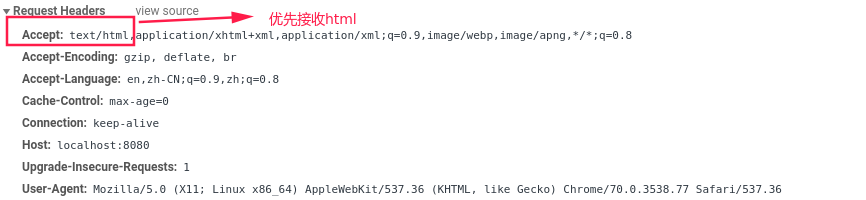

客户端的:

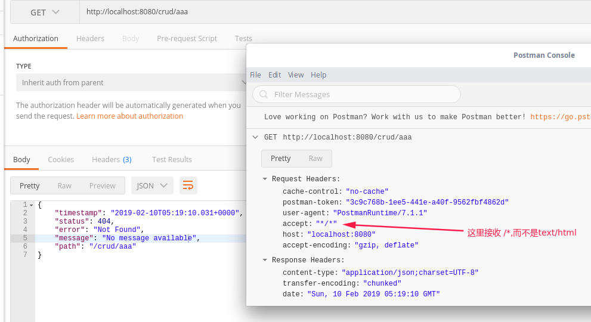

`3、ErrorPageCustomizer`：

```java
	@Value("${error.path:/error}")
	private String path = "/error";  系统出现错误以后来到error请求进行处理；（web.xml注册的错误页面规则）
```

`4、DefaultErrorViewResolver`：

```java
@Override
	public ModelAndView resolveErrorView(HttpServletRequest request, HttpStatus status,
			Map<String, Object> model) {
		ModelAndView modelAndView = resolve(String.valueOf(status), model);
		if (modelAndView == null && SERIES_VIEWS.containsKey(status.series())) {
			modelAndView = resolve(SERIES_VIEWS.get(status.series()), model);
		}
		return modelAndView;
	}

	private ModelAndView resolve(String viewName, Map<String, Object> model) {
        //默认SpringBoot可以去找到一个页面？  error/404
		String errorViewName = "error/" + viewName;
        
        //模板引擎可以解析这个页面地址就用模板引擎解析
		TemplateAvailabilityProvider provider = this.templateAvailabilityProviders
				.getProvider(errorViewName, this.applicationContext);
		if (provider != null) {
            //模板引擎可用的情况下返回到errorViewName指定的视图地址
			return new ModelAndView(errorViewName, model);
		}
        //模板引擎不可用，就在静态资源文件夹下找errorViewName对应的页面   error/404.html
		return resolveResource(errorViewName, model);
	}
```

步骤：

一但系统出现`4xx`或者`5xx`之类的错误；`ErrorPageCustomizer`就会生效（定制错误的响应规则）；就会来到`/error`请求；就会被**`BasicErrorController`**处理；

​	1）响应页面: 去哪个页面是由**`DefaultErrorViewResolver`**解析得到的；

```java
protected ModelAndView resolveErrorView(HttpServletRequest request,
      HttpServletResponse response, HttpStatus status, Map<String, Object> model) {
    //所有的ErrorViewResolver得到ModelAndView
   for (ErrorViewResolver resolver : this.errorViewResolvers) {
      ModelAndView modelAndView = resolver.resolveErrorView(request, status, model);
      if (modelAndView != null) {
         return modelAndView;
      }
   }
   return null;
}
```
​	2）响应`json`数据的处理: 

```java
    @RequestMapping
    public ResponseEntity<Map<String, Object>> error(HttpServletRequest request) {
        Map<String, Object> body = this.getErrorAttributes(request, this.isIncludeStackTrace(request, MediaType.ALL));
        HttpStatus status = this.getStatus(request);
        return new ResponseEntity(body, status);
    }
```

#### (2)、如何定制错误响应

**a、如何定制错误的页面；**

​		1）、有模板引擎的情况下；`error/状态码`;【**将错误页面命名为  错误状态码.html 放在模板引擎文件夹里面的 `error`文件夹下**】，发生此状态码的错误就会来到对应的页面；

​			我们可以使用`4xx`和`5xx`作为错误页面的文件名来匹配这种类型的所有错误，**精确优先（优先寻找精确的状态码.html）**；		

​		页面能获取的信息；

​			timestamp：时间戳

​			status：状态码

​			error：错误提示

​			exception：异常对象

​			message：异常消息

​			errors：JSR303数据校验的错误都在这里 

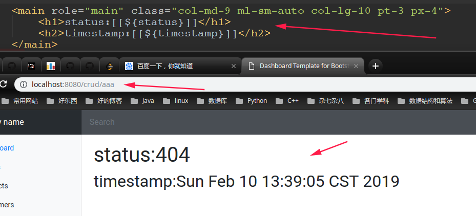

​		2）、没有模板引擎（模板引擎找不到这个错误页面），静态资源文件夹下找；

​		3）、以上都没有错误页面，就是默认来到SpringBoot默认的错误提示页面；

**b、如何定制错误的json数据；**

开始测试: 

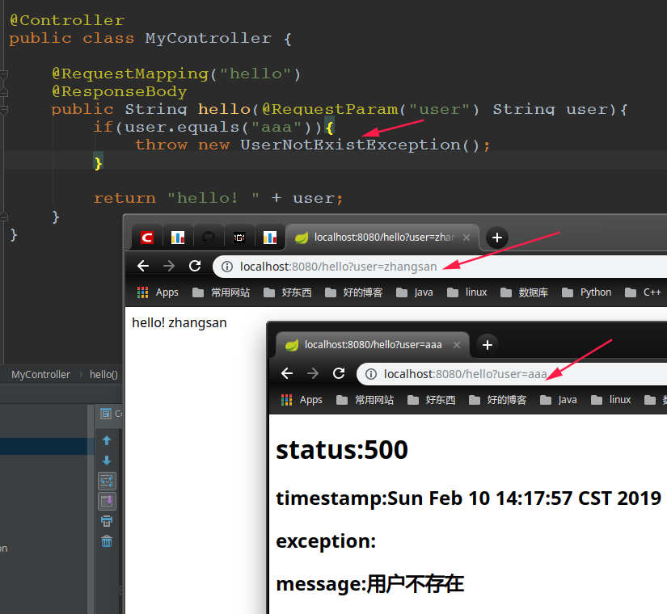

客户端方式: 

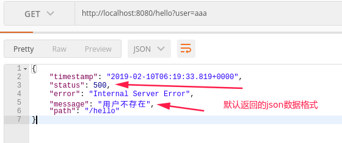

 

​	1）、自定义异常处理 & 返回定制`json`数据：

效果: 


代码: 

```java
@ControllerAdvice
public class MyExceptionHandler {
    @ResponseBody
    @ExceptionHandler(UserNotExistException.class)
    public Map<String, Object> handleException(Exception e){
        Map<String, Object> map = new HashMap<>();
        map.put("code", "user.not exist");
        map.put("message", e.getMessage());
        return map;
    }
}

//没有自适应效果...
```

​	2）、转发到`/error`进行自适应响应效果处理

效果: 

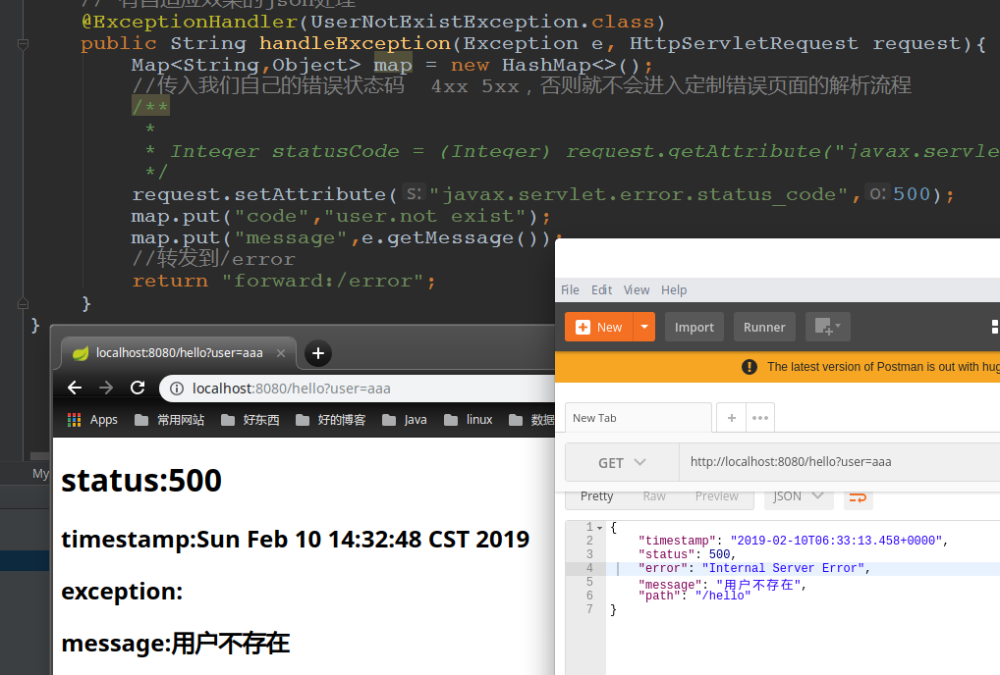

来源: `BasicErrorController`中errorHtml方法中的getStatus方法里面: 

```java
protected HttpStatus getStatus(HttpServletRequest request) {
    Integer statusCode = (Integer)request.getAttribute("javax.servlet.error.status_code");
    if (statusCode == null) {
        return HttpStatus.INTERNAL_SERVER_ERROR;
    } else {
        try {
            return HttpStatus.valueOf(statusCode.intValue());
        } catch (Exception var4) {
            return HttpStatus.INTERNAL_SERVER_ERROR;
        }
    }
}
```

具体的设置代码(有自适应效果): 

```java
// 有自适应效果的json处理
@ExceptionHandler(UserNotExistException.class)
public String handleException(Exception e, HttpServletRequest request){
    Map<String,Object> map = new HashMap<>();
    //传入我们自己的错误状态码  4xx 5xx，否则就不会进入定制错误页面的解析流程
    /**
         *
         * Integer statusCode = (Integer) request.getAttribute("javax.servlet.error.status_code");
         */
    request.setAttribute("javax.servlet.error.status_code",500);
    map.put("code","user.not exist");
    map.put("message",e.getMessage());
    //转发到/error
    return "forward:/error";
}
```

​	3）、将我们的定制数据携带出去；

出现错误以后，会来到`/error`请求，会被`BasicErrorController`处理，响应出去可以获取的数据是由`getErrorAttributes`得到的（是`AbstractErrorController（ErrorController）`规定的方法）；

​	1、完全来编写一个`ErrorController`(就不会用默认的)的实现类【或者是编写`AbstractErrorController`的子类】，放在容器中；(比较复杂 )

​	2、页面上能用的数据，或者是`json`返回能用的数据都是通过`errorAttributes.getErrorAttributes`得到；  容器中`DefaultErrorAttributes.getErrorAttributes()`；默认进行数据处理的；

自定义`ErrorAttributes`

```java
// 给容器中加入我们自己定义的ErrorAttributes
@Component
public class MyErrorAttributes extends DefaultErrorAttributes{

    // 返回值的map就是页面和json能获取的所有字段
    @Override
    public Map<String, Object> getErrorAttributes(WebRequest webRequest, boolean includeStackTrace) {
        Map<String, Object> map = super.getErrorAttributes(webRequest, includeStackTrace);
        map.put("company", "zxzxin"); //加上自己的字段 // 改变默认行为
        // 我们的异常处理器携带的数据
        Map<String, Object>extMap = (Map<String, Object>) webRequest.getAttribute("extMap", 0); // int SCOPE_REQUEST = 0; SCOPE_SESSION = 1;
        map.put("extMap", extMap);
        return map;
    }
}

```

最终的效果：响应是自适应的，可以通过定制`ErrorAttributes`改变需要返回的内容。

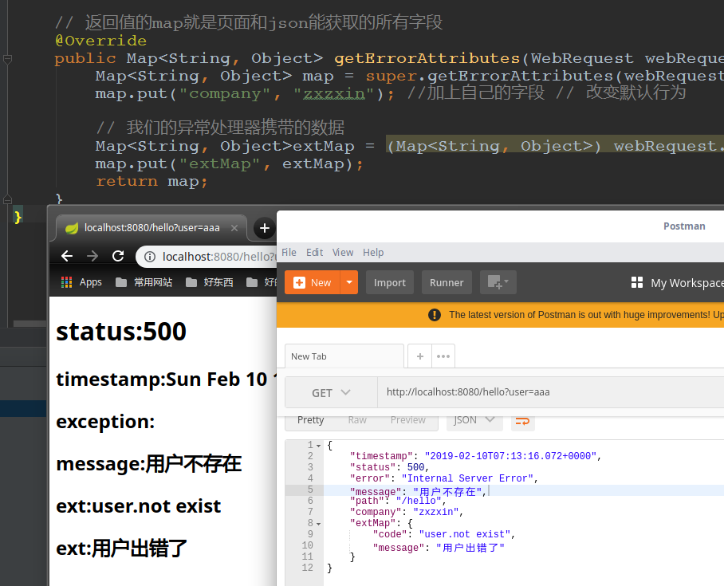

### 8、配置嵌入式Servlet容器

SpringBoot默认使用Tomcat作为嵌入式的Servlet容器；

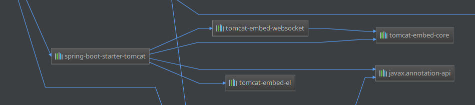

问题？

#### 1）、如何定制和修改Servlet容器的相关配置

1、方法一: 修改和`server`有关的配置（`ServerProperties`【也是`EmbeddedServletContainerCustomizer`】）；

```properties
server.port=8081
server.servlet.context-path=/servlet

server.tomcat.uri-encoding=UTF-8

//通用的Servlet容器设置
server.xxx
//Tomcat的设置
server.tomcat.xxx
```

2、方法二:  编写一个**`EmbeddedServletContainerCustomizer`**：嵌入式的Servlet容器的定制器；来修改Servlet容器的配置

这是SpringBoot1.0的废弃方案: 

```java
@Bean  //一定要将这个定制器加入到容器中
public EmbeddedServletContainerCustomizer embeddedServletContainerCustomizer(){
    return new EmbeddedServletContainerCustomizer() {

        //定制嵌入式的Servlet容器相关的规则
        @Override
        public void customize(ConfigurableEmbeddedServletContainer container) {
            container.setPort(8083);
        }
    };
}
```

SpringBoot2.0的新方案: 

```java
// 替代方案
// 博客 :  https://blog.csdn.net/Hard__ball/article/details/81281898
@Bean
public WebServerFactoryCustomizer<ConfigurableWebServerFactory> webServerFactoryCustomizer(){
    // 定制嵌入式的Servlet容器相关的规则
    return new WebServerFactoryCustomizer<ConfigurableWebServerFactory>() {
        @Override
        public void customize(ConfigurableWebServerFactory factory) {
            factory.setPort(8081);
        }
    };
    // 使用lambda表达式
    // return factory -> factory.setPort(8081);
}
```

#### 2）注册Servlet三大组件【Servlet、Filter、Listener】

由于SpringBoot默认是以`jar`包的方式启动嵌入式的Servlet容器来启动SpringBoot的web应用，没有`web.xml`文件。(以前是在`webapp/WEB-INF/web.xml`下注册)

注册三大组件用以下方式

`ServletRegistrationBean`

```java
//注册三大组件 - Servlet
@Bean
public ServletRegistrationBean myServlet(){
    return new ServletRegistrationBean(new MyServlet(),  "/myServlet");
}

```


`FilterRegistrationBean`

```java
// 注册Filter
@Bean
public FilterRegistrationBean myFilter(){
    FilterRegistrationBean filterRegistrationBean = new FilterRegistrationBean();
    filterRegistrationBean.setFilter(new MyFilter());
    filterRegistrationBean.setUrlPatterns(Arrays.asList("/hello", "/myServlet"));
    return filterRegistrationBean;
}
```

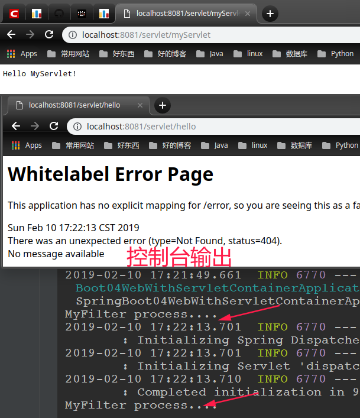

`ServletListenerRegistrationBean`

```java
// 注册Listener
@Bean
public ServletListenerRegistrationBean myListener(){
    return new ServletListenerRegistrationBean<>(new MyListener());
}
```

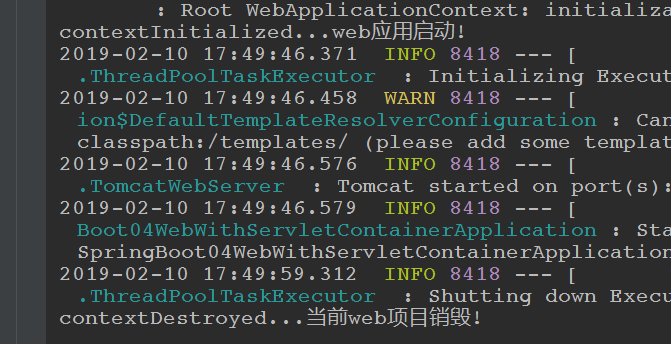

SpringBoot帮我们自动SpringMVC的时候，自动的注册SpringMVC的前端控制器；`DispatcherServlet`；

`DispatcherServletAutoConfiguration`中：

```java
@Bean(name = DEFAULT_DISPATCHER_SERVLET_REGISTRATION_BEAN_NAME)
@ConditionalOnBean(value = DispatcherServlet.class, name = DEFAULT_DISPATCHER_SERVLET_BEAN_NAME)
public ServletRegistrationBean dispatcherServletRegistration(
      DispatcherServlet dispatcherServlet) {
   ServletRegistrationBean registration = new ServletRegistrationBean(
         dispatcherServlet, this.serverProperties.getServletMapping());
    //默认拦截： /  所有请求；包静态资源，但是不拦截jsp请求；  /*会拦截jsp
    //可以通过server.servletPath来修改SpringMVC前端控制器默认拦截的请求路径
    
   registration.setName(DEFAULT_DISPATCHER_SERVLET_BEAN_NAME);
   registration.setLoadOnStartup(
         this.webMvcProperties.getServlet().getLoadOnStartup());
   if (this.multipartConfig != null) {
      registration.setMultipartConfig(this.multipartConfig);
   }
   return registration;
}

```

#### 3）、替换为其他嵌入式Servlet容器(SpringBoot能不能支持其他的Servlet容器)

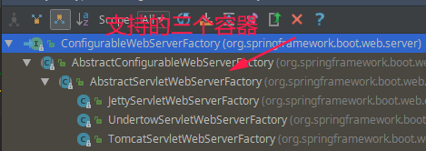

默认支持：

Tomcat（默认使用）

```xml
<dependency>
   <groupId>org.springframework.boot</groupId>
   <artifactId>spring-boot-starter-web</artifactId>
   引入web模块默认就是使用嵌入式的Tomcat作为Servlet容器；
</dependency>
```

Jetty

```xml
<!-- 引入web模块 排除了默认的tomcat-->
<dependency>
   <groupId>org.springframework.boot</groupId>
   <artifactId>spring-boot-starter-web</artifactId>
   <exclusions>
      <exclusion>
         <artifactId>spring-boot-starter-tomcat</artifactId>
         <groupId>org.springframework.boot</groupId>
      </exclusion>
   </exclusions>
</dependency>

<!--引入其他的Servlet容器-->
<dependency>
   <artifactId>spring-boot-starter-jetty</artifactId>
   <groupId>org.springframework.boot</groupId>
</dependency>
```

Undertow

```xml
<!-- 引入web模块 -->
<dependency>
   <groupId>org.springframework.boot</groupId>
   <artifactId>spring-boot-starter-web</artifactId>
   <exclusions>
      <exclusion>
         <artifactId>spring-boot-starter-tomcat</artifactId>
         <groupId>org.springframework.boot</groupId>
      </exclusion>
   </exclusions>
</dependency>

<!--引入其他的Servlet容器-->
<dependency>
   <artifactId>spring-boot-starter-undertow</artifactId>
   <groupId>org.springframework.boot</groupId>
</dependency>
```

#### 4）、嵌入式Servlet容器自动配置原理；

`EmbeddedServletContainerAutoConfiguration`：嵌入式的Servlet容器自动配置？

```java
@AutoConfigureOrder(Ordered.HIGHEST_PRECEDENCE)
@Configuration
@ConditionalOnWebApplication
@Import(BeanPostProcessorsRegistrar.class)
//导入BeanPostProcessorsRegistrar：Spring注解版；给容器中导入一些组件
//导入了EmbeddedServletContainerCustomizerBeanPostProcessor：
//后置处理器：bean初始化前后（创建完对象，还没赋值赋值）执行初始化工作
public class EmbeddedServletContainerAutoConfiguration {
    
    // 下面三个内部类，导入了哪个就用哪个容器
    
    @Configuration
	@ConditionalOnClass({ Servlet.class, Tomcat.class })//判断当前是否引入了Tomcat依赖；
	@ConditionalOnMissingBean(value = EmbeddedServletContainerFactory.class, search = SearchStrategy.CURRENT) //判断当前容器没有用户自己定义EmbeddedServletContainerFactory：嵌入式的Servlet容器工厂；作用：创建嵌入式的Servlet容器
	public static class EmbeddedTomcat {
		@Bean
		public TomcatEmbeddedServletContainerFactory tomcatEmbeddedServletContainerFactory() {
			return new TomcatEmbeddedServletContainerFactory();
		}
	}

	@Configuration
	@ConditionalOnClass({ Servlet.class, Server.class, Loader.class,
			WebAppContext.class })
	@ConditionalOnMissingBean(value = EmbeddedServletContainerFactory.class, search = SearchStrategy.CURRENT)
	public static class EmbeddedJetty {
		@Bean
		public JettyEmbeddedServletContainerFactory jettyEmbeddedServletContainerFactory() {
			return new JettyEmbeddedServletContainerFactory();
		}
	}

	@Configuration
	@ConditionalOnClass({ Servlet.class, Undertow.class, SslClientAuthMode.class })
	@ConditionalOnMissingBean(value = EmbeddedServletContainerFactory.class, search = SearchStrategy.CURRENT)
	public static class EmbeddedUndertow {
		@Bean
		public UndertowEmbeddedServletContainerFactory undertowEmbeddedServletContainerFactory() {
			return new UndertowEmbeddedServletContainerFactory();
		}
	}
```

1）、`EmbeddedServletContainerFactory`（嵌入式Servlet容器工厂）

```java
public interface EmbeddedServletContainerFactory {
   //获取嵌入式的Servlet容器
   EmbeddedServletContainer getEmbeddedServletContainer(
         ServletContextInitializer... initializers);
}
```

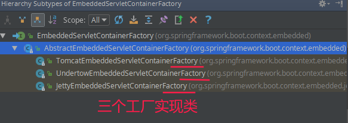

2）、`EmbeddedServletContainer`：（嵌入式的Servlet容器）

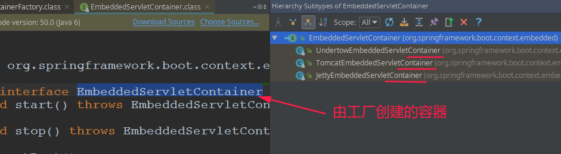

3）、以**TomcatEmbeddedServletContainerFactory**为例

```java
@Override
public EmbeddedServletContainer getEmbeddedServletContainer(
      ServletContextInitializer... initializers) {
    //创建一个Tomcat
   Tomcat tomcat = new Tomcat();
    
    //配置Tomcat的基本环节
   File baseDir = (this.baseDirectory != null ? this.baseDirectory
         : createTempDir("tomcat"));
   tomcat.setBaseDir(baseDir.getAbsolutePath());
   Connector connector = new Connector(this.protocol);
   tomcat.getService().addConnector(connector);
   customizeConnector(connector);
   tomcat.setConnector(connector);
   tomcat.getHost().setAutoDeploy(false);
   configureEngine(tomcat.getEngine());
   for (Connector additionalConnector : this.additionalTomcatConnectors) {
      tomcat.getService().addConnector(additionalConnector);
   }
   prepareContext(tomcat.getHost(), initializers);
    
    //将配置好的Tomcat传入进去，返回一个EmbeddedServletContainer；并且启动Tomcat服务器
   return getTomcatEmbeddedServletContainer(tomcat);
}
```

4）、我们对嵌入式容器的配置修改是怎么生效？

```
ServerProperties、EmbeddedServletContainerCustomizer
```

**`EmbeddedServletContainerCustomizer`**：定制器帮我们修改了Servlet容器的配置？

怎么修改的原理？

5）、容器中导入了**EmbeddedServletContainerCustomizerBeanPostProcessor**

```java
//初始化之前
@Override
public Object postProcessBeforeInitialization(Object bean, String beanName)
      throws BeansException {
    //如果当前初始化的是一个ConfigurableEmbeddedServletContainer类型的组件
   if (bean instanceof ConfigurableEmbeddedServletContainer) {
       //
      postProcessBeforeInitialization((ConfigurableEmbeddedServletContainer) bean);
   }
   return bean;
}

//上面调用的方法
private void postProcessBeforeInitialization(
			ConfigurableEmbeddedServletContainer bean) {
    //获取所有的定制器，调用每一个定制器的customize方法来给Servlet容器进行属性赋值；
    for (EmbeddedServletContainerCustomizer customizer : getCustomizers()) {
        customizer.customize(bean);
    }
}

private Collection<EmbeddedServletContainerCustomizer> getCustomizers() {
    if (this.customizers == null) {
        // Look up does not include the parent context
        this.customizers = new ArrayList<EmbeddedServletContainerCustomizer>(
            this.beanFactory
            //从容器中获取所有这葛类型的组件：EmbeddedServletContainerCustomizer
            //定制Servlet容器，给容器中可以添加一个EmbeddedServletContainerCustomizer类型的组件
            .getBeansOfType(EmbeddedServletContainerCustomizer.class,
                            false, false)
            .values());
        Collections.sort(this.customizers, AnnotationAwareOrderComparator.INSTANCE);
        this.customizers = Collections.unmodifiableList(this.customizers);
    }
    return this.customizers;
}

ServerProperties也是定制器 (实现了EmbeddedServletContainerCustomizer接口)
```

原理步骤：

1）、SpringBoot根据导入的依赖情况，给容器中添加相应的`EmbeddedServletContainerFactory`【如`TomcatEmbeddedServletContainerFactory`】

2）、容器中某个组件要创建对象就会惊动后置处理器；`EmbeddedServletContainerCustomizerBeanPostProcessor`；

只要是嵌入式的Servlet容器工厂，后置处理器就工作；

3）、后置处理器，从容器中获取所有的**`EmbeddedServletContainerCustomizer`**，**调用定制器的定制方法**


#### 5）、嵌入式Servlet容器启动原理；

什么时候创建嵌入式的Servlet容器工厂？什么时候获取嵌入式的Servlet容器并启动Tomcat；

获取嵌入式的Servlet容器工厂：

1）、SpringBoot应用启动运行`run`方法；

2）、`refreshContext(context);`SpringBoot刷新IOC容器【创建IOC容器对象，并初始化容器，创建容器中的每一个组件】；如果是web应用创建**AnnotationConfigEmbeddedWebApplicationContext**，否则：**AnnotationConfigApplicationContext**；

3）、` refresh(context);`**刷新刚才创建好的ioc容器；**代码如下:

```java
public void refresh() throws BeansException, IllegalStateException {
   synchronized (this.startupShutdownMonitor) {
      // Prepare this context for refreshing.
      prepareRefresh();

      // Tell the subclass to refresh the internal bean factory.
      ConfigurableListableBeanFactory beanFactory = obtainFreshBeanFactory();

      // Prepare the bean factory for use in this context.
      prepareBeanFactory(beanFactory);

      try {
         // Allows post-processing of the bean factory in context subclasses.
         postProcessBeanFactory(beanFactory);

         // Invoke factory processors registered as beans in the context.
         invokeBeanFactoryPostProcessors(beanFactory);

         // Register bean processors that intercept bean creation.
         registerBeanPostProcessors(beanFactory);

         // Initialize message source for this context.
         initMessageSource();

         // Initialize event multicaster for this context.
         initApplicationEventMulticaster();

         // Initialize other special beans in specific context subclasses.
         onRefresh();

         // Check for listener beans and register them.
         registerListeners();

         // Instantiate all remaining (non-lazy-init) singletons.
         finishBeanFactoryInitialization(beanFactory);

         // Last step: publish corresponding event.
         finishRefresh();
      }

      catch (BeansException ex) {
         if (logger.isWarnEnabled()) {
            logger.warn("Exception encountered during context initialization - " +
                  "cancelling refresh attempt: " + ex);
         }

         // Destroy already created singletons to avoid dangling resources.
         destroyBeans();

         // Reset 'active' flag.
         cancelRefresh(ex);

         // Propagate exception to caller.
         throw ex;
      }

      finally {
         // Reset common introspection caches in Spring's core, since we
         // might not ever need metadata for singleton beans anymore...
         resetCommonCaches();
      }
   }
}
```

4）、`onRefresh(); `web的IOC容器重写了`onRefresh`方法

5）、webIOC容器会创建嵌入式的Servlet容器；**createEmbeddedServletContainer**();

**6）、获取嵌入式的Servlet容器工厂：**

```java
// 从ioc容器中获取EmbeddedServletContainerFactory 组件；
EmbeddedServletContainerFactory containerFactory = getEmbeddedServletContainerFactory();
```

**TomcatEmbeddedServletContainerFactory**创建对象，后置处理器`BeanPostProcesser`一看是这个对象，就获取所有的定制器来先定制Servlet容器的相关配置；

7）、**使用容器工厂获取嵌入式的Servlet容器**：

```java
this.embeddedServletContainer = containerFactory.getEmbeddedServletContainer(getSelfInitializer());
```

8）、嵌入式的Servlet容器创建对象并启动Servlet容器；

**先启动嵌入式的Servlet容器，再将ioc容器中剩下没有创建出的对象获取出来；**

**IOC容器启动创建嵌入式的Servlet容器** 

### 9、使用外置的Servlet容器

嵌入式Servlet容器：应用打成可执行的`jar`

* 优点：简单、便携；

* 缺点：默认不支持JSP、优化定制比较复杂（使用定制器【`ServerProperties`、自定义`EmbeddedServletContainerCustomizer`】，自己编写嵌入式Servlet容器的创建工厂【`EmbeddedServletContainerFactory`】）；

可以使用外置的Servlet容器：外面安装`Tomcat`---应用war包的方式打包；

#### (1)、步骤

1）、必须创建一个war项目；（利用idea创建好目录结构）

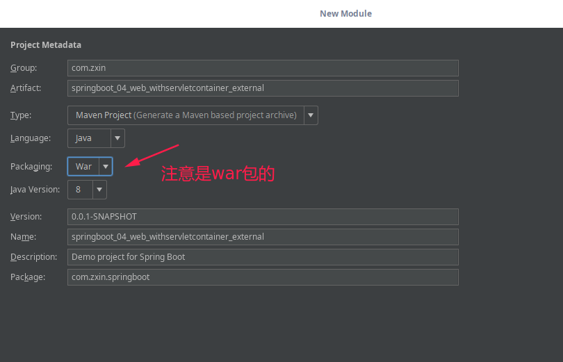

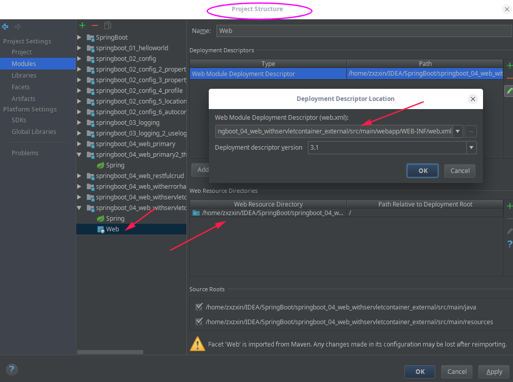

可以将应用打成`war`包，也可以将IDE整合外部服务器`tomcat`:

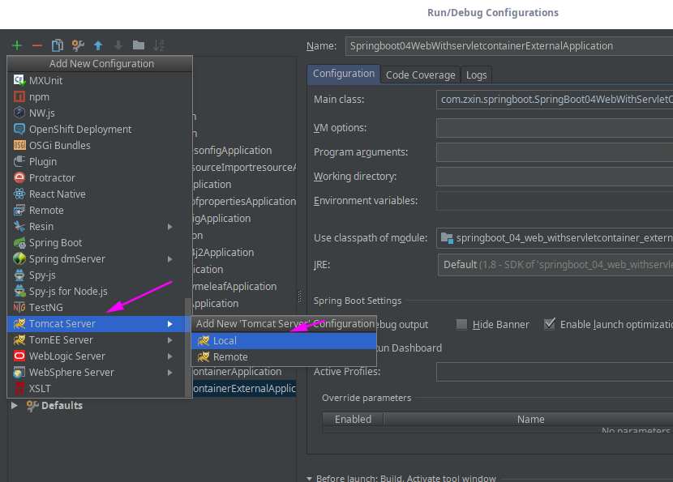

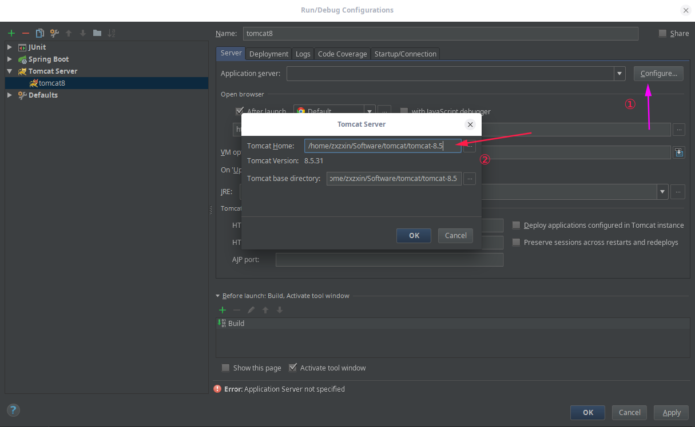

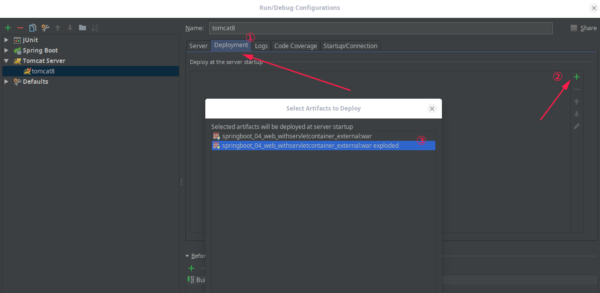

2）、将嵌入式的Tomcat指定为`provided`；

```xml
<dependency>
    <groupId>org.springframework.boot</groupId>
    <artifactId>spring-boot-starter-tomcat</artifactId>
    <scope>provided</scope>
</dependency>
```

3）、必须编写一个**SpringBootServletInitializer**的子类，并调用`configure`方法

```java
public class ServletInitializer extends SpringBootServletInitializer {

	@Override
	protected SpringApplicationBuilder configure(SpringApplicationBuilder application) {
        // 传入SpringBoot的主程序
		return application.sources(SpringBoot04WebWithServletContainerExternalApplication.class);
	}
}
```

4）、启动服务器就可以使用；

#### (2)、原理

`jar`包：执行SpringBoot主类的main方法，启动IOC容器，创建嵌入式的Servlet容器；

`war`包：启动服务器，**服务器启动SpringBoot应用**【SpringBootServletInitializer】，启动ioc容器；

servlet3.0（Spring注解版）：

8.2.4 Shared libraries / runtimes pluggability：

规则：

​	1）、服务器启动（web应用启动）会创建当前web应用里面每一个jar包里面ServletContainerInitializer实例：

​	2）、ServletContainerInitializer的实现放在jar包的META-INF/services文件夹下，有一个名为javax.servlet.ServletContainerInitializer的文件，内容就是ServletContainerInitializer的实现类的全类名

​	3）、还可以使用@HandlesTypes，在应用启动的时候加载我们感兴趣的类；


流程：

1）、启动Tomcat

2）、org\springframework\spring-web\4.3.14.RELEASE\spring-web-4.3.14.RELEASE.jar!\META-INF\services\javax.servlet.ServletContainerInitializer：

Spring的web模块里面有这个文件：**org.springframework.web.SpringServletContainerInitializer**

3）、SpringServletContainerInitializer将@HandlesTypes(WebApplicationInitializer.class)标注的所有这个类型的类都传入到onStartup方法的Set<Class<?>>；为这些WebApplicationInitializer类型的类创建实例；

4）、每一个WebApplicationInitializer都调用自己的onStartup；


5）、相当于我们的SpringBootServletInitializer的类会被创建对象，并执行onStartup方法

6）、SpringBootServletInitializer实例执行onStartup的时候会createRootApplicationContext；创建容器

```java
protected WebApplicationContext createRootApplicationContext(
      ServletContext servletContext) {
    //1、创建SpringApplicationBuilder
   SpringApplicationBuilder builder = createSpringApplicationBuilder();
   StandardServletEnvironment environment = new StandardServletEnvironment();
   environment.initPropertySources(servletContext, null);
   builder.environment(environment);
   builder.main(getClass());
   ApplicationContext parent = getExistingRootWebApplicationContext(servletContext);
   if (parent != null) {
      this.logger.info("Root context already created (using as parent).");
      servletContext.setAttribute(
            WebApplicationContext.ROOT_WEB_APPLICATION_CONTEXT_ATTRIBUTE, null);
      builder.initializers(new ParentContextApplicationContextInitializer(parent));
   }
   builder.initializers(
         new ServletContextApplicationContextInitializer(servletContext));
   builder.contextClass(AnnotationConfigEmbeddedWebApplicationContext.class);
    
    //调用configure方法，子类重写了这个方法，将SpringBoot的主程序类传入了进来
   builder = configure(builder);
    
    //使用builder创建一个Spring应用
   SpringApplication application = builder.build();
   if (application.getSources().isEmpty() && AnnotationUtils
         .findAnnotation(getClass(), Configuration.class) != null) {
      application.getSources().add(getClass());
   }
   Assert.state(!application.getSources().isEmpty(),
         "No SpringApplication sources have been defined. Either override the "
               + "configure method or add an @Configuration annotation");
   // Ensure error pages are registered
   if (this.registerErrorPageFilter) {
      application.getSources().add(ErrorPageFilterConfiguration.class);
   }
    //启动Spring应用
   return run(application);
}
```

7）、Spring的应用就启动并且创建IOC容器

```java
public ConfigurableApplicationContext run(String... args) {
   StopWatch stopWatch = new StopWatch();
   stopWatch.start();
   ConfigurableApplicationContext context = null;
   FailureAnalyzers analyzers = null;
   configureHeadlessProperty();
   SpringApplicationRunListeners listeners = getRunListeners(args);
   listeners.starting();
   try {
      ApplicationArguments applicationArguments = new DefaultApplicationArguments(
            args);
      ConfigurableEnvironment environment = prepareEnvironment(listeners,
            applicationArguments);
      Banner printedBanner = printBanner(environment);
      context = createApplicationContext();
      analyzers = new FailureAnalyzers(context);
      prepareContext(context, environment, listeners, applicationArguments,
            printedBanner);
       
       //刷新IOC容器
      refreshContext(context);
      afterRefresh(context, applicationArguments);
      listeners.finished(context, null);
      stopWatch.stop();
      if (this.logStartupInfo) {
         new StartupInfoLogger(this.mainApplicationClass)
               .logStarted(getApplicationLog(), stopWatch);
      }
      return context;
   }
   catch (Throwable ex) {
      handleRunFailure(context, listeners, analyzers, ex);
      throw new IllegalStateException(ex);
   }
}
```

**启动Servlet容器，再启动SpringBoot应用**

