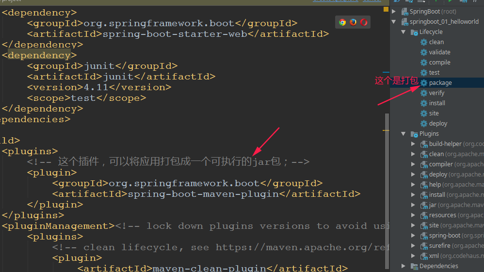
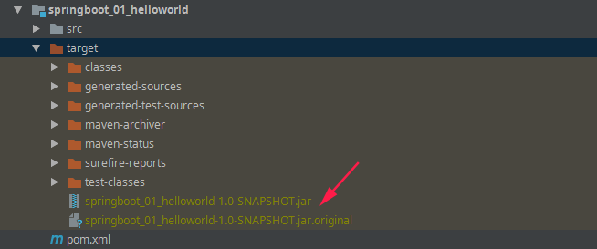
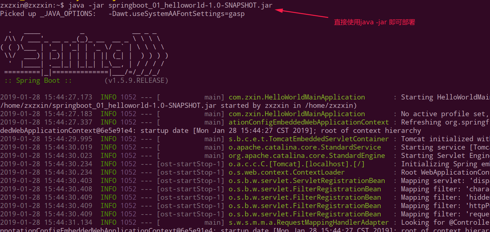
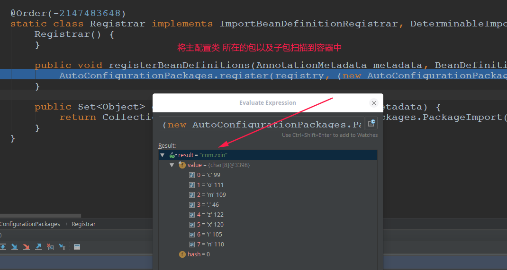
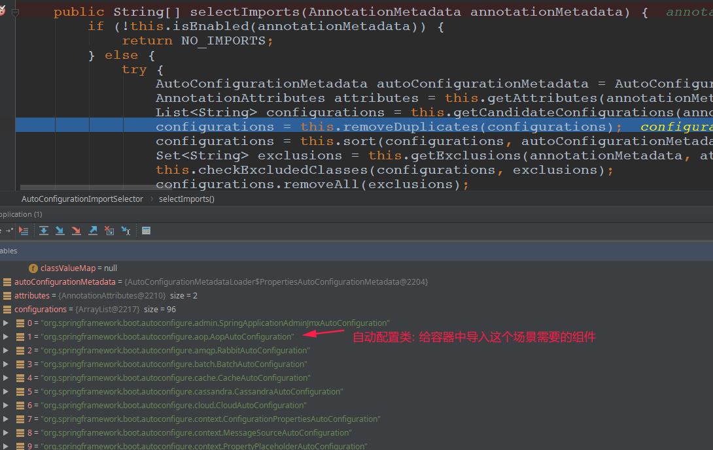
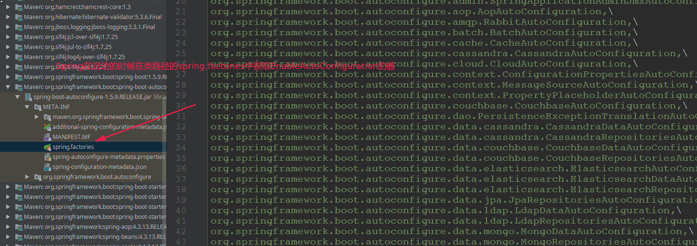
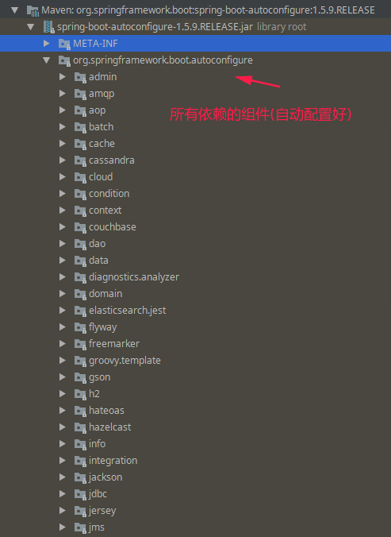
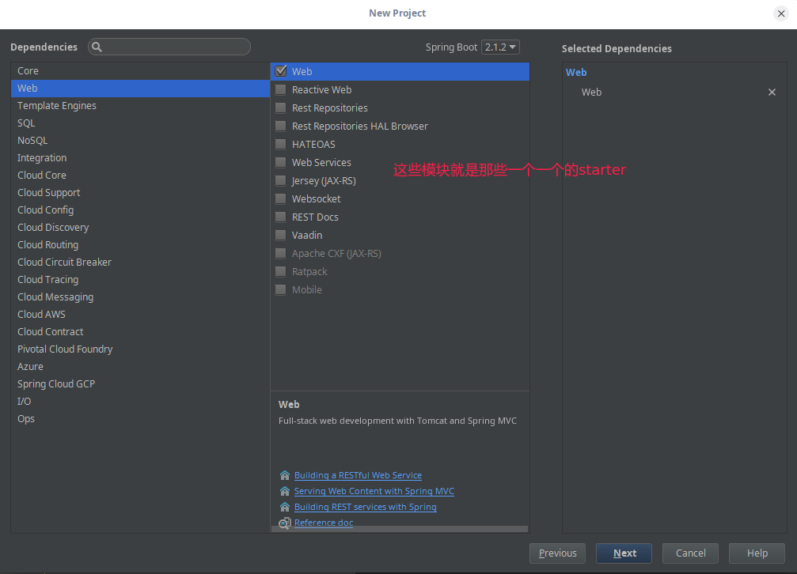
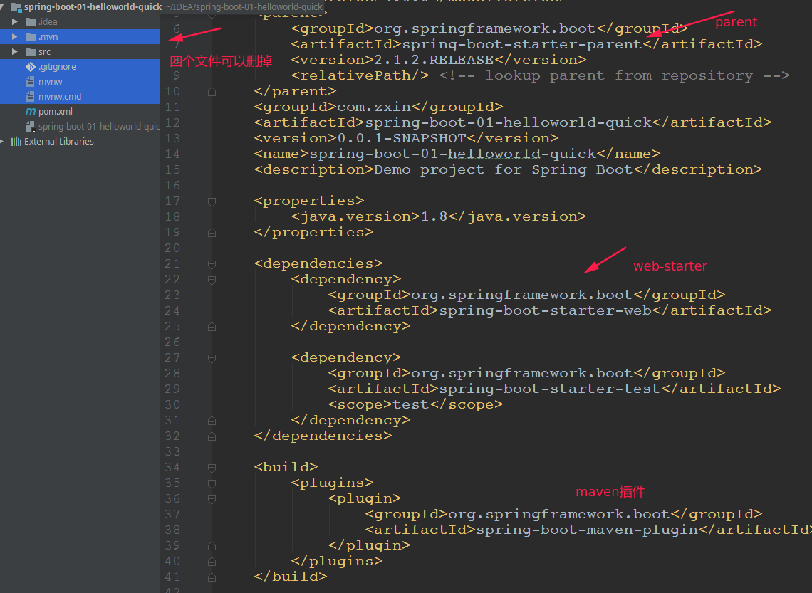
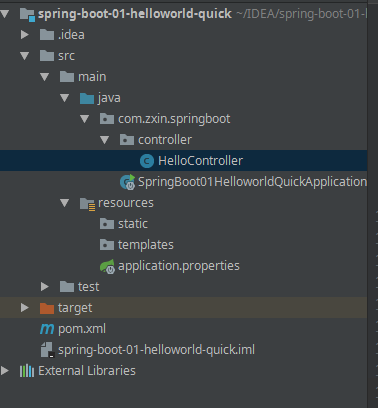

# SpringBoot 总笔记
<!-- TOC -->

- [一、SpringBoot入门](#一springboot入门)
  - [1、基本介绍](#1基本介绍)
  - [2、微服务](#2微服务)
  - [3、MAVEN设置](#3MAVEN设置)
  - [4、Spring Boot HelloWorld](#4spring-boot-helloWorld)
  - [5、Hello World探究](#5hello-world探究)
  - [6、使用Spring Initializer快速创建Spring Boot项目](#6使用spring-initializer快速创建spring-boot项目)
- [二、配置文件](#二配置文件 )
  - [1 、配置文件](1 配置文件)
  - [2、YAML语法](2YAML语法)
  - [3、配置文件值注入-对应springboot_02_config项目](3配置文件值注入-对应springboot_02_config项目)
  - [4、application.yml对应的application.properties配置-springboot_02_config_2_propertiesonfig项目](4application.yml对应的application.properties配置-springboot_02_config_2_propertiesonfig项目)

<!-- /TOC -->


## 一、SpringBoot入门

### 1、基本介绍
* 简化`Spring`应用开发的一个框架、整个`Spring`技术栈的一个大整合；
* `J2EE`开发的一站式解决方案；

优点：
* 快速创建独立运行的`Spring`项目以及与主流框架集成；
* 使用嵌入式的`Servlet`容器，应用无需打成`WAR`包；
* `starters`自动依赖与版本控制；
* 大量的自动配置，简化开发，也可修改默认值；
* 无需配置`XML`，无代码生成，开箱即用；
* 准生产环境的运行时应用监控；
* 与云计算的天然集成；

### 2、微服务
*  [martin fowler论文](https://martinfowler.com/articles/microservices.html#MicroservicesAndSoa)提出。
*  微服务：架构风格（服务微化）
*  一个应用应该是一组小型服务；可以通过`HTTP`的方式进行互通；
*  单体应用：`ALL IN ONE`
*  微服务：每一个功能元素最终都是一个可独立替换和独立升级的软件单元；


### 3、MAVEN设置
给`maven` 的`settings.xml`配置文件的`profiles`标签添加下面的代码：

```xml
<profile>
  <id>jdk-1.8</id>
  <activation>
    <activeByDefault>true</activeByDefault>
    <jdk>1.8</jdk>
  </activation>
  <properties>
    <maven.compiler.source>1.8</maven.compiler.source>
    <maven.compiler.target>1.8</maven.compiler.target>
    <maven.compiler.compilerVersion>1.8</maven.compiler.compilerVersion>
  </properties>
</profile>
```
表示`maven`使用`jdk1.8`。

### 4、Spring Boot HelloWorld
实现功能：

> 浏览器发送`hello`请求，服务器接受请求并处理，响应`Hello Springboot! `字符串；即浏览器输入 `localhost:8080/hello`可以看到浏览器显示`Hello SpringBoot!`字符串；

**① 创建一个`maven`工程（`jar`）；**

**② 导入`spring boot`相关的依赖；**

```xml
<parent>
    <groupId>org.springframework.boot</groupId>
    <artifactId>spring‐boot‐starter‐parent</artifactId>
    <version>1.5.9.RELEASE</version>
</parent>
<dependencies>
    <dependency>	
        <groupId>org.springframework.boot</groupId>
        <artifactId>spring‐boot‐starter‐web</artifactId>
    </dependency>
</dependencies>
```


**③ 编写一个主程序，启动`Spring Boot`应用**

```java
/**
 *  @SpringBootApplication 来标注一个主程序类，说明这是一个Spring Boot应用
 */
@SpringBootApplication
public class HelloWorldMainApplication {

    public static void main(String[] args) {

        // Spring应用启动起来
        SpringApplication.run(HelloWorldMainApplication.class, args);
    }
}
```
**④ 编写相关的`Controller`**

```java
@Controller
public class HelloController {

    @ResponseBody
    @RequestMapping("/hello")
    public String hello(){
        return "Hello SpringBoot!";
    }
}
```
**⑤ 运行主程序测试**

**⑥简化部署**

将这个应用打成`jar`包，直接使用`java-jar`的命令进行执行；



```xml
 <!-- 这个插件，可以将应用打包成一个可执行的jar包；-->
  <build>
       <plugins>
           <plugin>
               <groupId>org.springframework.boot</groupId>
               <artifactId>spring-boot-maven-plugin</artifactId>
           </plugin>
        </plugins>
  </build>
```

结果: 







### 5、Hello World探究

#### `Pom.xml`文件

父项目

```xml
<parent>
    <groupId>org.springframework.boot</groupId>
    <artifactId>spring-boot-starter-parent</artifactId>
    <version>1.5.9.RELEASE</version>
</parent>
```

他的父项目:

```xml
<parent>
	<groupId>org.springframework.boot</groupId>
 	<artifactId>spring-boot-dependencies</artifactId>
 	<version>1.5.9.RELEASE</version>
 	<relativePath>../../spring-boot-dependencies</relativePath>
</parent>
```

**他来真正管理`Spring Boot`应用里面的所有依赖版本；**

**也就是`Spring Boot`的版本仲裁中心；**

**以后我们导入依赖默认是不需要写版本；**（没有在`dependencies`里面管理的依赖自然需要声明版本号）

启动器: 

```xml
<dependency>
    <groupId>org.springframework.boot</groupId>
    <artifactId>spring-boot-starter-web</artifactId>
</dependency>
```

**spring-boot-starter**-web：

* `spring-boot-starter`：`spring-boot`场景启动器；帮我们导入了`web`模块正常运行所依赖的组件；

`Spring Boot`将所有的功能场景都抽取出来，做成一个个的`starters`（启动器），只需要在项目里面引入这些`starter`相关场景的所有依赖都会导入进来。要用什么功能就导入什么场景的启动器。

#### 主程序类，主入口类 


```java
@SpringBootApplication
public class HelloWorldMainApplication {

    public static void main(String[] args) {

        // Spring应用启动起来
        SpringApplication.run(HelloWorldMainApplication.class,args);
    }
}
```

① `@SpringBootApplication`: `Spring Boot`应用标注在某个类上说明这个类是`SpringBoot`的<font color = red>主配置类</font>，`SpringBoot`就应该运行这个类的`main`方法来启动`SpringBoot`应用；这是一个<font color = red>**组合注解**</font>。

```java
@Target({ElementType.TYPE})
@Retention(RetentionPolicy.RUNTIME)
@Documented
@Inherited
@SpringBootConfiguration
@EnableAutoConfiguration
@ComponentScan(
    excludeFilters = {@Filter(
    type = FilterType.CUSTOM,
    classes = {TypeExcludeFilter.class}
), @Filter(
    type = FilterType.CUSTOM,
    classes = {AutoConfigurationExcludeFilter.class}
)}
)
public @interface SpringBootApplication {
	...
}
```
下面看里面的每个注解含义: 

* `@SpringBootConfiguration`: `Spring Boot`的配置类，标注在某个类上，表示这是一个`Spring Boot`的配置类，里面包含这个`@Configuration`（也就是`Spring`里面的配置类）；

```java
@Target({ElementType.TYPE})
@Retention(RetentionPolicy.RUNTIME)
@Documented
@Configuration
public @interface SpringBootConfiguration {
}
```

配置类 -----> 配置文件；配置类也是容器中的一个组件：`@Component`

```java
@Target({ElementType.TYPE})
@Retention(RetentionPolicy.RUNTIME)
@Documented
@Component //组件注解 
public @interface Configuration {
    @AliasFor(
        annotation = Component.class
    )
    String value() default "";
}

```

② `@EnableAutoConfiguration`：开启自动配置功能；

以前我们需要配置的东西，`Spring Boot`帮我们自动配置；`@EnableAutoConfiguration`告诉`SpringBoot`开启自动配置功能，这样自动配置才能生效；

```java
@AutoConfigurationPackage
@Import({AutoConfigurationImportSelector.class})
public @interface EnableAutoConfiguration {
}
```

* `@AutoConfigurationPackage`：自动配置包

  * `@Import(AutoConfigurationPackages.Registrar.class)`：`Spring`的底层注解`@Import`，给容器中导入一个组件；导入的组件由`AutoConfigurationPackages.Registrar.class`指定。
    也就是: 将主配置类（`@SpringBootApplication`标注的类）的**所在包及下面所有子包里面的所有组件扫描到Spring容器；，所以如果上面的`controller `如果不是在主配置类所在的包(或者子包)下，就不能扫描到。**

  

* `@Import(EnableAutoConfigurationImportSelector.class)`: 给容器中导入组件(不在同一个包下面的)`EnableAutoConfigurationImportSelector`：导入哪些组件的选择器；将所有需要导入的组件以全类名的方式返回，这些组件就会被添加到容器中；会给容器中导入非常多的自动配置类（`xxxAutoConfiguration`）；就是给容器中导入这个场景需要的所有组件，并配置好这些组件；
    

    

    有了自动配置类，免去了我们手动编写配置注入功能组件等的工作；
    里面的`getCandidateConfigurations`调用了下面的一个方法: 
    `SpringFactoriesLoader.loadFactoryNames(EnableAutoConfiguration.class,classLoader)`
    Spring Boot在启动的时候从类路径下的`META-INF/spring.factories`中获取`EnableAutoConfiguration`指定的值，将这些值作为自动配置类导入到容器中，自动配置类就生效，帮我们进行自动配置工作；以前我们需要自己配置的东西，自动配置类都帮我们；

    

    

    

    J2EE的整体整合解决方案和自动配置都在`spring-boot-autoconfigure-xxx.RELEASE.jar`；
    


### 6、使用Spring Initializer快速创建Spring Boot项目

IDE都支持使用Spring的项目创建向导快速创建一个Spring Boot项目。选择我们需要的模块，向导会联网创建Spring Boot项目，默认生成的Spring Boot项目；
主程序生成好了，我们只需要我们自己的逻辑。
* `resources` : 文件夹中目录结构
  * `static`：保存所有的静态资源； `js css images`；
  * `templates`：保存所有的模板页面；（Spring Boot默认`jar`包使用嵌入式的`Tomcat`，默认不支持`JSP`页
    面）；可以使用模板引擎（`freemarker`、`thymeleaf`）；
  * `application.properties`：Spring Boot应用的配置文件，可以修改一些默认设置；








结构目录：



简单`Controller`，注意`@RestController`注解。


```java
package com.zxin.springboot.controller;
import org.springframework.web.bind.annotation.RequestMapping;
import org.springframework.web.bind.annotation.ResponseBody;
import org.springframework.web.bind.annotation.RestController;

//@ResponseBody // 这个类的所有方法返回的数据直接写给浏览器(如果是对象　-> 转成json)
//@Controller

@RestController // 这个注解的作用和上面两个一起的作用相同 (就是 ResponseBody和Controller的合体)
public class HelloController {

    @ResponseBody //如果每个类都需要写，麻烦
    @RequestMapping("/hello")
    public String hello(){
        return "hello quick SpringBoot!";
    }
}

```


***

## 二、配置文件 

### 1 、配置文件

SpringBoot使用一个全局的配置文件，下面两者都会当做是配置文件，配置文件名是固定的；
* `application.properties`；
* `application.yml`；

配置文件的作用：**修改SpringBoot自动配置的默认值，SpringBoot在底层都给我们自动配置好；**

`YAML（YAML Ain't Markup Language）`

```xml
YAML A Markup Language：是一个标记语言
YAML isn't Markup Language：不是一个标记语言
```

标记语言：
以前的配置文件，大多都使用的是` xxxx.xml`文件；

`YAML`：以**数据为中心，比`json`、`xml`等更适合做配置文件**；

`yaml`配置例子:

```yaml
server:
  port:  8081
```
对应`xml`配置例子:

```xml
<server>
	<port>8081</port>
</server>
```

### 2、YAML语法

基本语法: 
* `k:(空格)v `：表示一对键值对( **空格必须有**）；
* 以**空格**的缩进来控制层级关系；**只要是左对齐的一列数据，都是同一个层级的；**
* 属性和值也是大小写敏感；

值的写法: 

* 字面量：普通的值（数字，字符串，布尔）；

* `k: v` ： 字面直接来写；

>**字符串默认不用加上单引号或者双引号**；
> * `""`双引号：不会转义字符串里面的特殊字符，特殊字符会作为本身想表示的意思。
>    `name: "zhangsan \n lisi"`输出 : `zhangsan 换行 lisi`；
> * `''`单引号：会转义特殊字符，特殊字符最终只是一个普通的字符串数据。
>    `name: ‘zhangsan \n lisi’`输出 :  `zhangsan \n lisi`；

对象、`Map`（属性和值）（键值对）：

`k: v`：在下一行来写对象的属性和值的关系，注意缩进。
对象还是`k: v`的方式
```yaml
friends:
	lastName: zhangsan
	age: 20
```
行内写法：
```yaml
friends: {lastName: zhangsan,age: 18 }
```
数组（`List`、`Set`）：
用`- 值`(注意有空格)表示数组中的一个元素
```yaml
pets:
 ‐ cat
 ‐ dog
 ‐ pig
```
行内写法
```yaml
pets: [cat,dog,pig]
```

### 3、配置文件值注入-对应springboot_02_config项目 
`JavaBean`配置：
```java
/**
 * 将配置文件中配置的每一个属性的值，映射到这个组件中
 * @ConfigurationProperties：告诉SpringBoot将本类中的所有属性和配置文件中相关 的配置进行绑定；
 *      prefix = "person"：配置文件中哪个下面的所有属性进行一一映射
 * 只有这个组件是容器中的组件，才能使用容器提供的@ConfigurationProperties功能；
 * 所以需要使用@Component注解;
 *  @ConfigurationProperties(prefix = "person")默认从全局配置文件中获取值(也可以指定文件)；
 */
@Component("myPerson")
@ConfigurationProperties(prefix = "person")
public class Person {

    private String lastName;
    private Integer age;
    private Boolean boss;

    private Date birth;
    private Map<String,Object> maps;
    private List<Object> lists;
    private Dog dog;
}
```
`application.yml`文件配置
```yaml
server:
  port: 8081

person:
  lastName: zhangsan
  age: 18
  boss: false
  birth: 2018/01/02
  maps: {k1 : v1, k2 : 100}
  lists:
    - lisi
    - wangwu
  dog:
    name: 小狗
    age: 5
```

可以导入配置文件处理器，以后编写配置就有提示了。

```xml
<!--导入配置文件处理器，配置文件进行绑定就会有提示-->
<dependency>
    <groupId>org.springframework.boot</groupId>
    <artifactId>spring-boot-configuration-processor</artifactId>
    <optional>true</optional>
</dependency>
```

### 4、application.yml对应的application.properties配置-springboot_02_config_2_propertiesonfig项目

上面的`application.yml`配置文件也可以使用`application.properties`文件来替换: 

```properties
server.port=8081

# 乱码问题
spring.http.encoding.force=true
spring.http.encoding.charset=UTF-8
spring.http.encoding.enabled=true
server.tomcat.uri-encoding=UTF-8

# 配置person的值
person.last-name=zhangsan
person.age=18
person.birth=2018/01/02
person.boss=false
person.maps.k1=v1
person.maps.k2=100
person.lists=lisi,wangwu
person.dog.name=小狗
person.dog.age=5
```

### 